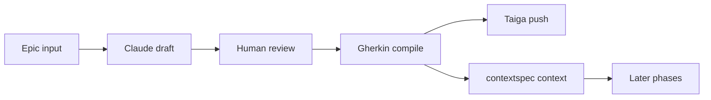

# bolt

bolt is a Streamlit app for turning an Epic into Taiga work while keeping the approved requirements in local markdown context.


## How it works



1. Open Phase 1 and enter or select an Epic.
2. Claude generates a Natural Language story draft.
3. Edit the draft in the UI.
4. The app compiles the draft into strict Gherkin.
5. Edit story titles and Gherkin per story, then confirm the push.
6. Stories are created in Taiga and the approved Gherkin is written to `contextspec/`.

## What works now

### Phase 1 · Requirements

- Load or create a Taiga Epic
- Generate Natural Language user stories via Claude
- Edit the draft before locking it in
- Compile the draft into formal Gherkin
- Edit story titles and Gherkin per story
- Push stories to Taiga
- Save the approved Gherkin into `contextspec/functional-spec.md`

### Phases 2–6

Present in the UI as placeholders: Design, Implementation, Testing, Deployment, Maintenance.

## Architecture

| File / folder | Role |
|---|---|
| `app.py` | Entry point — Streamlit setup, theme injection, page routing |
| `components/sidebar.py` | Navigation, AI/Taiga status, live context editor |
| `components/phase1.py` | Full Phase 1 workflow |
| `ai_engine.py` | LangChain + Claude prompts and structured outputs |
| `context_manager.py` | Reads/writes `contextspec/` markdown files |
| `taiga_adapter.py` | Taiga REST API client |
| `views/` | Thin Streamlit page wrappers |
| `contextspec/` | Persistent project context (Gherkin, memory bank, etc.) |

## Tech stack

Python 3.12 · Streamlit · LangChain · Anthropic Claude · Pydantic · Requests · python-dotenv

---

## Running the app

### Prerequisites

| Requirement | Notes |
|---|---|
| Python 3.12+ | Local dev only |
| Docker 24+ | Container run |
| Anthropic API key | Required |
| Taiga account | Required for push actions |

### 1 · Environment setup

```bash
cp .env.example .env
```

Edit `.env`:

```env
ANTHROPIC_API_KEY=sk-ant-...

TAIGA_API_URL=https://api.taiga.io
TAIGA_PROJECT_ID=<your-project-id>
TAIGA_USERNAME=<your-email>
TAIGA_PASSWORD=<your-password>
TAIGA_AUTH_TOKEN=          # leave blank — auto-filled on first run

# Optional model overrides
# AI_MODEL_FAST=claude-haiku-4-5-20251001
# AI_MODEL_CODER=claude-sonnet-4-6
```

> **Never commit `.env`.** It is listed in `.gitignore`.

### 2 · Local Python

```bash
pip install -r requirements.txt
streamlit run app.py
```

Open [http://localhost:8501](http://localhost:8501). The `contextspec/` directory is created automatically on first use.

### 3 · Docker

```bash
docker build -t bolt-cli:local .

docker run --env-file .env \
  -p 8501:8501 \
  -v "$(pwd)/contextspec:/app/contextspec" \
  bolt-cli:local
```

The `-v` flag mounts `contextspec/` so context files survive container restarts.

### 4 · Docker Compose (recommended)

```bash
docker compose up --build
```

Compose reads `.env` automatically and mounts `contextspec/` as a volume. Open [http://localhost:8501](http://localhost:8501).

```bash
docker compose down   # stop
```

### 5 · Pre-built image from CI

After each push to `main`, GitHub Actions publishes a fresh image:

```bash
docker run --env-file .env \
  -p 8501:8501 \
  -v "$(pwd)/contextspec:/app/contextspec" \
  ghcr.io/thomastabs/bolt-cli:latest
```

Pin to a specific commit to avoid surprise updates:

```bash
ghcr.io/thomastabs/bolt-cli:sha-<commit>
```

---

## Tests

All external APIs are mocked — no real credentials needed:

```bash
pip install -r requirements.txt pytest
python3 -m pytest tests/ -v
```

## CI/CD

`.github/workflows/ci.yml` runs on every push and pull request to `main`:

| Job | When | What |
|---|---|---|
| `test` | every push / PR | Runs all 178 pytest tests with stub env vars |
| `build` | after `test` passes | Builds the Docker image; pushes to `ghcr.io` on `main` only |

Registry auth uses the built-in `GITHUB_TOKEN` — no manual secrets needed.
