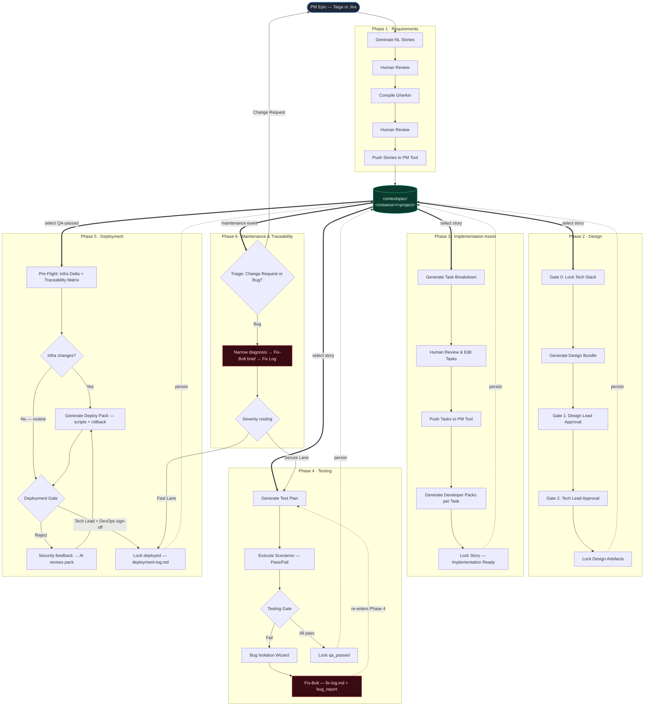

# Apex

Apex is an academic AI-guided SDLC tool that combines a **Spec-Anchored workflow**, **AI**, **Taiga or Jira** as project management backend, and optional **GitHub** repository context and **Figma** design context. The app helps a team move from product requirements into design artefacts while keeping the important project context in persistent, human-readable files.

The current migrated version is a split full-stack web app:

- **Backend:** Python 3.12, FastAPI, Pydantic v2, LangChain, Anthropic Claude / OpenAI GPT / Google Gemini
- **Frontend:** Next.js 15 App Router, TypeScript, React Query 5, Zustand, Tailwind CSS
- **Storage:** `contextspec/` folder in Azure File Share in deployment
- **Deployment:** GitHub Actions builds Docker images and deploys to Azure Container Apps

Phases 1–6 are implemented, plus a governance analytics dashboard, a **living traceability graph** (project-wide spec→code derivation view), and an **Autopilot** mode that runs the full Phases 1–5 pipeline end-to-end in the background. The spec-model upgrade roadmap is fully shipped: EARS constraints, spec↔code conformance, deterministic agent-target compilation, controlled spec co-evolution, and per-epic context slicing. Human-in-the-loop guardrails layer on top — multi-model cross-check, diff-on-regenerate, a decision log, and an optional "Guide the AI" steer on every generative step.


---

## Implemented Workflow

> UML diagrams (PlantUML sources): the user flow is a sequence diagram in
> [`docs/user-flow.puml`](docs/user-flow.puml) and the system architecture a
> component diagram in [`docs/architecture.puml`](docs/architecture.puml).
> Rendered PNG + SVG live in [`docs/diagrams/`](docs/diagrams). Re-render with
> `java -jar plantuml.jar -tsvg docs/*.puml` (the component diagram is laid out
> with Graphviz for orthogonal routing — `sudo apt install graphviz`).



**How to read it.** Each phase is its own swim-lane. The green cylinder is the
versioned spec store (`contextspec/`) — the single source of truth. Bold arrows
(`select story`) are a human entering a phase by picking work off the PM board;
dashed arrows (`persist`) are the phase locking its artefacts back into the store
and advancing `story-index.json`. Everything is gated by a human review or
sign-off before it locks.

### Phase 1 · Requirements

Phase 1 turns PM epics into approved user stories and Gherkin acceptance criteria. Works with both Taiga and Jira Cloud via the PM adapter layer.

Implemented:

- Load existing epics from Taiga or Jira
- Create a new epic or use an existing one
- Ask Claude to suggest epics from the project concept
- **Generate stories from Figma** — pick designed frames from a linked Figma file and turn them into a user-story draft grounded in the real screens (navigation flows between frames become scenarios; with a vision model the selected frames are rendered to images and sent to the AI, so stories reflect the actual pixels, not just frame names). Paste a **project URL** to span all of the project's files in one combined draft — a multi-file union still renders each frame against its own file for image grounding (the image budget is spread across the selected files). Requires a Figma file connected in the sidebar
- Generate Natural Language story drafts
- Review and edit drafts before formalization
- Compile reviewed drafts into Gherkin
- Review and edit compiled Gherkin
- Push approved stories to the connected PM tool
- Persist approved Gherkin into `functional-spec.md`
- Update `story-index.json` with `gherkin_locked` state
- Generate project-wide **constraints** in EARS notation (performance, security, reliability, …) into `constraints.md` — Gherkin captures behaviour; this captures cross-cutting quality attributes. Editable, and injected into Phase 3 developer packs and Phase 4 test plans so the technical work honours them

### Phase 2 · Design

Phase 2 creates a unified project-wide design **draft** from all locked Phase 1 stories.
All generated artefacts are AI suggestions — starting points for team review, not final deliverables.
The Design Lead and Tech Lead must review, edit if needed, and explicitly sign off before anything is locked.

Implemented:

- Gate 0: propose and lock a project-wide tech stack into `tech-stack.md`
- Generate a **Screen Inventory** or **Component Spec** (user-selectable toggle) as Step 1 — either a per-screen UI summary grouped by epic, or an Atomic Design component catalog (atoms → molecules → organisms) with props, states, and usage context
- Generate a **design bundle** in a 3-section AI cascade (each section uses previous output as context for consistency):
  1. **UX Brief** — user flows, navigation paths, and interaction patterns referencing Step 1
  2. **Endpoints** — API surface with auth, request/response contracts (`METHOD /path · auth · in:{} · out:{}`)
  3. **Data Model** — entities, fields, and relations consistent with the endpoint contracts
- All sections are editable in-place before locking
- Results appear incrementally as each section completes
- Each section has a collapsible visualization panel — auto-generated when the section completes, persisted so it loads instantly on return:
  - **UX Brief → Screen Flow** (React Flow) — screens as nodes, navigation actions as labelled directed edges; dagre left-to-right auto-layout; drag to rearrange; layout saved to `diagram-screens.json`
  - **Endpoints → API Surface** — client-side parse of the endpoint markdown; groups by resource; at the top a method distribution summary — color-coded pill counts (GET green, POST blue, PUT/PATCH amber, DELETE red) with a proportional stacked bar showing API shape at a glance; each endpoint row is an accordion — collapsed shows method badge, path, and auth; expanded reveals request and response fields as typed key:type pills (e.g. `username:string`); zero AI cost
  - **Data Model → ER Diagram** (React Flow) — entities as cards with field types; primary keys amber, foreign keys blue; dagre auto-layout; drag to rearrange; layout saved to `diagram-er.json`
- Export the full draft as a Markdown file for offline review
- Gate 1: Design Lead sign-off (screens & flows)
- Gate 2: Tech Lead sign-off (architecture & specs)
- Persist locked artefacts into two non-overlapping files:
  - `technical-spec.md` — the **machine contract** (Endpoints + Data Model); injected as `technical_spec` into Phases 3–6
  - `design-bundle.md` — the **human UX doc** (UX Brief); injected as `design_bundle` into Phase 3
  - `tech-stack.md`
  - `story-index.json`
- Transition stories to design-ready status in the PM tool (browser-side, no backend PM calls)
- GitHub repository context (`github-context.md`) is injected into AI prompts when available

**Design Delta — incremental design for post-lock stories.** The full flow above is project-wide; it used to be the *only* way in, so a story pushed after the design lock forced a full regeneration over every story (churning an approved design to admit one addition). Phase 2 now detects stories that arrived after the lock (a violet banner: "N stories arrived after the design lock") and offers an additive pass instead:

- The locked design (technical-spec.md including prior deltas + the UX brief) is injected into the AI **read-only** — the prompt's job is to produce *only* the additions the new stories need (UX addendum, new endpoints, new entities/fields), reusing existing endpoints and entities by exact name.
- The result is reviewed in three editable blocks before anything is written, then **merged into the corresponding locked sections in place** — new endpoints into the Endpoints section, new entities into the Data Model, the UX addendum into the UX Brief — so the artifacts read exactly as if everything had been designed from the start (and everything that consumes the sections — Phase 3–6 prompt injection, the Phase 2 editors, the screen-flow builder — picks the additions up for free). The audit trail is the design block's covered-stories id line, the semver bump, and the amendment record; the covered stories transition to `design_locked` (index + PM tool) like any designed story.
- **Honest semver:** a purely additive delta bumps the spec **MINOR** version (`1.0.0 → 1.1.0`) — the first edit the system can *prove* is non-breaking, which is why plain amendments are always MAJOR. The AI must also declare a `touches_existing` list (existing endpoints/entities the new stories force a change to); a non-empty list is surfaced as an amber warning and, on merge, records a real amendment — a MAJOR bump, logged in `amendments.md` against the previously designed stories only, never on the delta's own.
- Two silent bypasses closed along the way: the story index used to sweep **every** gherkin-locked story to `design_locked` whenever a project design existed (a late story skipped design entirely — the design block now records its covered story ids, and only those are marked; legacy specs without the id line keep the old behaviour), and re-persisting a full design over a locked one used to replace the contract with no amendment or version bump — it now records a MAJOR amendment against the previously designed stories.

### Phase 3 · Implementation Assist

Phase 3 turns locked design artefacts into actionable developer tasks and coding proposals.
It operates story-by-story and stays open through testing: stories with `design_locked`,
`implementation`, `qa`, or `qa_passed` status are eligible (so you can add/regenerate packs even
after a story advanced). Task subjects, descriptions, effort and covered-scenario metadata are
read back from the PM tool's **task detail** endpoint (the list endpoint omits the encoded
apex-meta block), so they survive a round-trip through Taiga/Jira intact.

Implemented — 4-stage stepper workflow:

**Stage A — Select Story**

- Filter by epic from a dropdown
- Browse eligible stories in a 2×2 paged card grid (Prev/Next navigation)
- Each card shows a Gherkin scenario preview and the story title

**Stage B — Generate Tasks**

- View the full Gherkin spec for the selected story
- Ask the AI to decompose the story into developer implementation tasks (subject + description each)
- Review and edit the generated task list before proceeding; add or remove tasks manually
- **Figma-grounded decomposition** — when a Figma file is synced, the screens, screen flow, and design system (component inventory, colour/text tokens) from `figma-context.md` are injected, so UI tasks reference the real screens, navigation, and components instead of inventing them (advisory; never adds work beyond the Gherkin)

**Stage C — Developer Packs**

- Push all tasks to the PM tool as subtasks (browser-direct); each task gets a PM ref, and pushed tasks link out to their Taiga task page
- For each task, generate a **Developer Pack** — a structured Markdown coding proposal including context, approach, and acceptance checklist; GitHub repository context is injected when available
- **Deterministic agent-target compilation:** the AI produces one structured pack (context, steps, files, test assertions); the multi-target export wrappers — **Agentic Brief**, **Chat Prompt** — are rendered by pure code templates over those fields, so they cannot drift from each other and cost no extra tokens (roadmap #3). No provider-specific export (e.g. CLAUDE.md) — Apex is multi-model (Claude/GPT/Gemini)
- **Cross-pack consistency:** each pack is generated aware of the story's already-saved sibling packs (a compact Context + Files-to-Change digest), so packs reuse the same files/entities/endpoints and don't redefine or duplicate each other — generate task 1's pack first, then 2+ align to it
- **Design-grounded packs** — the synced Figma design system is injected into every pack; and when the story is **linked to a Figma frame**, that frame is rendered to a PNG and attached to the pack so the agentic brief a coding agent consumes is grounded in the *literal designed screen* (layout, components, states), not a text description. Multimodal (vision models only), advisory — an unlinked story or a non-vision model falls back to the text-only pack
- View and edit packs in an in-browser editor; re-generate any pack if needed
- Packs are auto-saved to `proposal_story_<id>_task_<id>.md` in `contextspec/`

**Stage D — Lock**

- Lock the story into `implementation` status; all task packs must be saved before locking is allowed
- Export all developer packs for the story as a single ZIP download
- Updates `story-index.json` with `has_proposal: true` and `phase_status: "implementation"`

### Phase 4 · Testing

Phase 4 is the QA validation playbook. It operates story-by-story on stories with `implementation` status and provides AI-assisted test plan generation, manual scenario execution tracking, and a bug isolation wizard.

Implemented — 4-stage stepper workflow:

**Stage A — Select Story**

- Filter eligible stories (`implementation` status) grouped by epic; 2×2 paged card grid
- Each card shows: story ID badge, Gherkin scenario preview, "Plan ready" badge if a test plan is already saved, and "Regression Bypass" badge for stories re-entering after a Fix-Bolt cycle

**Stage B — Test Plan**

- Breadcrumb: Stories → Epic → US#ID Story Title
- Acceptance Criteria (Gherkin) panel expanded by default
- Implementation Tasks list — each task shows effort estimate badge (XS–XL), subject, and description (read from the PM detail endpoint so descriptions/effort are accurate)
- AI generates a full per-scenario test plan: Test Steps, Expected Results, Edge Cases, Risk Areas, plus a **BDD Mapping** (framework-agnostic Given/When/Then + endpoints/entities/fixtures/assertions) for each Gherkin scenario
- The plan ends with agent-handoff sections like a Developer Pack — **Agentic Test Brief** (inferred BDD framework + test-file paths + run command + constraints) and **Chat Prompt** — so a dev/QA exports the plan and an AI agent writes the automated tests
- The plan is **grounded in the story's developer packs** (Context + Files-to-Change digests), so Test Steps and BDD Mappings reference the real implementation; still strictly bounded to the Gherkin (no invented scenarios)
- When a Figma file is synced, the **design context** (screens + prototype flows) also grounds the plan, so navigation / screen-transition checks reference the real designed screens and intended flow (advisory; never adds scenarios absent from the Gherkin)
- Edit the generated test plan in a monospace textarea before saving
- Download `.md` / Copy / **Clear Plan** actions — Clear deletes the saved plan server-side, wipes the local execution draft, and rolls the story from `qa` back to `implementation` (never demotes `qa_passed`); Regenerate replaces the plan in place
- Save & Continue → Stage C (saves to `bdd_story_{id}.feature`)

**Stage C — Execute Tests**

- Progress bar: X / Y scenarios marked
- Per-scenario cards with **Pass** / **Fail** toggle buttons; colour-coded (green / red)
- Fail → inline notes textarea expands for reproduction steps and observed vs expected behaviour
- Expandable "View test steps" per scenario (collapsible section from the test plan)
- **Explore edge cases** per scenario — on-demand AI button that surfaces non-obvious boundary/error/abuse probes beyond the plan's happy path, grounded in the scenario + technical spec
- Regression Bypass mode: amber banner shown; previously failed scenarios highlighted in amber
- All scenarios must be marked before proceeding to the Testing Gate

**Stage D — Testing Gate**

- Summary card: all pass (green) or N failed (red, with list of failing scenario names)
- **Pass path:** lock story to `qa_passed` status → optional PM story status update → "Test Another Story"
- **Fail path → Bug Isolation Wizard:**
  - AI analyses all failed scenarios + QA notes to generate a **Fix-Bolt artifact**: Bug Summary, Failed Scenario, Root Cause Hypothesis, Patch Scope, Reproduction Steps, Fix-Bolt Brief
  - Preview in monospace panel; Download `.md` / Copy Fix-Bolt Brief
  - **Trigger Fix-Bolt:** saves `bug_report_{id}.md`, appends `fix-log.md`, marks story with `has_bug_report`; story returns to `implementation` and re-enters Phase 4 as Regression Bypass on next select

### Phase 5 · Deployment

Phase 5 implements the framework's Deployment & Release playbook as a governance layer: Apex records gate decisions and artifacts; it does not trigger real deployments. It operates story-by-story on `qa_passed` stories.

Implemented — 4-stage stepper workflow:

**Stage A — Select Story**

- QA-passed stories grouped by epic; 2×2 paged card grid
- Badges: "Delta ready", "Pack ready", "Routine" (bypass verdict)

**Stage B — Pre-Flight**

- **AI Infrastructure Delta Check** — answers one question: does deploying this story need new infra, env vars, secrets, migrations, or CI changes, or is it a routine deployment on the existing pipeline? Context is strictly narrowed (story Gherkin + technical spec + tech stack + GitHub context when synced)
- Fully editable verdict: routine/changes toggle, rationale, per-item rows (category: env var / migration / IaC / CI config / secret; risk: low/high); add or remove items
- **Traceability Matrix** panel — zero AI calls; assembles Gherkin scenarios × PM task "Covers" metadata × saved developer packs × persisted QA results; gaps (`NO_COVERING_TASK`, `TASK_WITHOUT_PACK`, `NOT_TESTED`, `ORPHAN_COVERS`) shown as amber rows, advisory only
- Saved to `infra_delta_story_<id>.json` (+ rendered `.md`)

**Stage C — Deploy Pack (or Routine Bypass)**

- Routine verdict → bypass banner, straight to the gate
- Changes flagged → AI generates a **Deploy Pack**: per-item scripts (env diffs, migration SQL with rollback, IaC/CI fragments, secret provisioning instructions — never values) plus a Rollback Plan; editable split-pane editor; saved to `deploy_pack_story_<id>.md`

**Stage D — Deployment Gate**

- Evidence summary: delta verdict, pack status, traceability matrix (auto-persisted to `verification_story_<id>.json` as gate evidence)
- Two human sign-offs required: **Tech Lead** (pack reviewed) and **Security Reviewer** (security review passed)
- **Approve:** story locks to `deployed`, a machine-parseable record (route, sign-offs, traceability summary) is appended to `deployment-log.md`, optional PM story status update
- **Reject:** security feedback is fed to the AI, which revises the pack → back to Stage C

### Phase 6 · Maintenance & Traceability

Phase 6 (`/phase6`) is tabbed: **Maintenance** and **Traceability**.

**Maintenance Triage (F1) + Fix-Bolt & Severity Routing (F2)** — the framework's Maintenance & Evolution playbook:

- **Intake** of post-deployment feedback from three sources: a manual in-app form, **GitHub Issues**, and **Taiga Issues** (read-only import; net-new or linked to a deployed story)
- **AI Triage** classifies each item: **Path A — Change Request** (business deviation) is never patched directly — it is logged and routed to Phase 1 discovery ("Open in Phase 1"); **Path B — Bug** (technical deviation) proceeds to diagnosis
- **Narrow diagnosis** under the **Context Isolation Rule** — the AI sees only the bug report + test evidence + the isolated code snippet (never whole-project context), and proposes a root cause for the human to verify (no patch yet)
- **Fix-Bolt brief** — a deterministic, code-rendered agent directive (problem, failing contract, patch directive, files, regression-guard tests) grounded in the verified diagnosis
- **Severity Routing** (AI suggests, human decides) — **Fast Lane** (low-risk) routes the linked story straight to a deployment record bypassing QA; **Secure Lane** (high-risk) re-enters Phase 4 as a QA Regression Bypass; **Resolve** records a permanent **Fix Log** entry in `fix-log.md`
- Items persist in `maintenance_items.json`; events are logged to `maintenance-log.md`

**Traceability Explorer (F3) — spec↔code conformance:**

- Verifies shipped code against the locked spec for a story. A deterministic **Layer A** parses the technical-spec endpoint contracts, Gherkin scenarios, and EARS constraints, then locates route declarations and tests in the synced GitHub context (framework-aware patterns) with **per-line citations** (`path:line`)
- An AI **Layer B** confirms/corrects each row with file citations and returns `unknown` when the code is not in context — never assuming conformance
- **Layer B+ — adversarial multi-agent panel (opt-in "Deep verify"):** rather than trust a single LLM pass for the disputed rows, the verifier reuses Layer B as a baseline auditor, then escalates only the *contested* rows (ambiguous status, or status that disagrees with Layer A) to a three-role panel — a **Prosecutor** (argues the code drifts), a **Defender** (argues it conforms), and a **Judge** that reconciles each row with a file citation. The Judge may only assign `present`/`tested` when it cites code actually in context (enforced in code, not just the prompt) — otherwise the row stays `unknown`. Confident rows pass through untouched, so the panel can only sharpen the ambiguous verdicts. Each reconciled row reports its agreement (unanimous / split) and the Judge's rationale in the UI. Same model throughout; ~4 flat AI calls regardless of how many rows are contested (the Judge is one batched call). Default verify is the single pass — the panel is opt-in per check
- **On-demand file fetch:** for any `unknown` row, fetch the implicated file from GitHub and re-verify with it in context (no whole-repo dump)
- The **score (0–100) is computed in code** from the findings, never by the AI (true for Layer A, B, and the panel); reports persist to `conformance_story_<id>.json` (panel runs additionally carry a `panel_meta` block of per-row verdicts)

**Spec-anchored regression scan:** conformance answers "does this story's code honour its spec *now*". The **"Scan for regressions"** action answers the inverse — "did a later code change *break* a story that previously conformed". It re-verifies every story that already has a conformance report against the freshly-synced code, then compares each new result to the last persisted report with a pure code diff (`ai_engine.diff_conformance`): a story has **regressed** when its code-computed score fell, OR a row dropped to a strictly worse status (`present→missing/mismatch`, `tested→untested/partial`). Regressions raise a `conformance_regressed` story-index flag (distinct from a spec amendment — this one fires on a CODE change, not a spec edit) that surfaces three ways over one source — a red board badge + a StoryDialog banner with **Acknowledge**, a contributing reason in the predictive-risk score, and an inline per-story results list in the Traceability Explorer (`old→new` score + which rows worsened). The flag **clears automatically** when a later scan shows recovery, or on manual Acknowledge. On-demand and sequential (single-writer safe); the diff verdict itself never asks an LLM. Optionally runs each re-verify through the adversarial panel.

**Backward trace propagation:** the spec flows downstream (each phase grounds in the previous), but a downstream failure used to be a dead end. Now a failing signal points back at the **source spec** it derived from and suggests the phase to re-open: a low/regressed Phase 6 conformance row, or an uncovered/untested scenario in the Phase 5 verification matrix, raises a `trace_flag` that names the source — a failing **scenario** → its Gherkin (Phase 1); a failing **endpoint/constraint** → the technical-spec/constraints (Phase 2), choosing the earliest source phase. It surfaces as a violet board badge + a StoryDialog banner with a **"Re-open Phase N"** link and **Acknowledge**, plus a predictive-risk reason. **Suggest-only** — it never rolls back `phase_status`; the human decides. The mapping is a pure code function (`ai_engine.derive_trace_targets`/`summarize_trace`), never an LLM.

**GitHub webhook — auto context resync + regression scan on push:** the regression scan above is on-demand (a human clicks "Scan for regressions"), and Sync Context is normally a button click too. A repo can instead register `POST /api/webhooks/github/{instance_id}/{project_id}` as its push webhook (payload URL + HMAC secret generated per instance, shown in the sidebar GitHub panel under "Auto regression scan & context sync on push") so every push closes both loops itself: **every push** re-clones and repacks `github-context.md` (the same server-side clone+repomix pipeline as a manual Sync), and the handler additionally matches the push's touched files against each story's saved developer-pack "Files to Change" (pure string overlap, no AI) to re-verify conformance for just the affected stories — both run as background tasks (the webhook response returns immediately — GitHub's 10s delivery timeout would otherwise kill either job mid-flight). Both share one 5-minute per-project cooldown gate (repacking runs on every push within the window regardless of whether any story matched; the regression scan additionally requires a match) so a burst of pushes can't trigger unbounded AI/clone spend. Requests are rejected unless the `X-Hub-Signature-256` HMAC matches the per-instance secret (`backend/app/api/github_webhook.py`) — unauthenticated by necessity (GitHub can't send a bearer token) but never trusted without it.

### Specs as a living document

Spec files are editable at any time, locked or not — "locked" gates which AI workflows are eligible for the next phase, it never freezes the file. Editing a **locked** spec artifact (e.g. `functional-spec.md` after `gherkin_locked`, `technical-spec.md`/`design-bundle.md`/`constraints.md` after `design_locked`) via the sidebar is never silent, though: the edit is logged to `amendments.md` as a dated **amendment** naming which stories were at/after that file's lock when it happened. That's an audit trail, not a required review — there's no flag, no badge, no acknowledge step. Specs work as an always-current library of guidelines, requirements, plans, and tests; Phase 3–6 prompts always inject whatever the file currently says.

**Semantic versioning.** Every lockable artifact carries a real version number so humans can consult "has this actually changed since I last read it" without diffing markdown by eye: `0.0.0` while still a pre-lock draft, `1.0.0` the moment it locks, `+1` MAJOR on every post-lock amendment, and `+1` **MINOR** for a [Design Delta](#phase-2--design) append — the one edit the system can *prove* is additive (nothing existing changed). There is still no PATCH: the data model has no signal for a cosmetic edit, and faking one would be noise. Versions persist in `spec-versions.json` and show as a badge next to each locked file in the sidebar's Active Context panel.

### Human-in-the-loop guardrails

- **Preset tech stacks (Phase 2)** — a "Start from a preset" picker seeds the editable Technology Choices draft from a curated list (Next.js + FastAPI, Django + React, Express + Mongo, T3, Spring Boot + React, FastAPI + HTMX). No AI call — skips the propose round-trip for common stacks; the user edits the seeded markdown and locks as usual.
- **Diff-on-regenerate** — regenerating an artifact that already has content (Phase 2 design section, Phase 3 developer pack, Phase 4 test plan, Phase 5 deploy pack) no longer silently replaces it: a modal shows an old-vs-new line diff (dependency-free LCS) with **Accept** (replace) / **Discard** (keep current). First-generation and bulk generation commit directly. Deliberate revisions (e.g. a Phase 5 deploy-pack revise with feedback) commit directly — the gate is for blind regenerations only.
- **Decision log** — Apex remembers rejected work. Discarding a regeneration, or revising a deploy pack with feedback, appends a dated entry to an append-only `decisions.md` (viewable + hand-editable in the sidebar). The log is fed back into Phase 3 coding-proposal prompts as advisory **negative constraints** ("approaches already rejected — do not re-propose"), EMPTY-default so it changes nothing until decisions exist.
- **Multi-model cross-check (Phase 1/2/3)** — on demand, run a structured phase through the active model **and** a second configured provider, then show where they disagree via a pure set-diff (no AI in the diff). Available on Phase 1 (story scenarios), Phase 2 (design endpoints) and Phase 3 (task decomposition); the panel lists *agreed* vs *only-in-each* items with per-item **Add** and **Add all**, so the human folds in what the first model missed. A model picker lets you choose which provider to cross-check against (a keyed, different-provider model) or auto-pick; the button is gated on ≥2 keyed providers (Anthropic / OpenAI / Google are all wired in `ai_engine`). Distinct from the same-provider adversarial conformance panel (Phase 6 "Deep verify").
- **Guide the AI (Phases 1–5)** — every generative step takes an optional free-text guidance note (collapsible "Guide the AI" input) threaded into the prompt as an advisory block — emphases, conventions, things to favour or avoid — EMPTY-default so it never overrides the spec/Gherkin or anti-hallucination rules. Originally on Phase 4/5 (test plan / deploy pack); now consistent across Phase 1 (story generation), Phase 2 (design) and Phase 3 (task decomposition) for cross-phase consistency.

### Analytics

The `/analytics` page computes the framework's Core Governance Metrics on demand from the story index and context artifacts:

- **Cycle time per gate transition** — median/p90 hours from `status_history` timestamps recorded at every phase transition (Fix-Bolt re-entries restart the clock)
- **Context Traceability Rate** — % of deployed stories with a complete artifact chain (Gherkin + test plan + infra delta + complete matrix + deployment-log entry)
- **Spec Conformance Rate** — average spec↔code conformance score across implemented stories that have a Phase 6 conformance report
- **Fix-Bolt defect proxy** — total/avg Fix-Bolt triggers per story (Apex has no production telemetry, so QA-caught defects stand in for the Defect Escape Rate)
- **Predictive risk** — a deterministic, explainable per-story risk score (`none`/`low`/`medium`/`high`) derived from already-logged signals (Fix-Bolt count, conformance score, active regression bypass, cycle time vs cohort p90) with the contributing reasons; surfaced as a sorted **Risk** column in the drill-down (and a red/amber dot on board story rows) so at-risk stories are flagged before they fail
- Phase funnel and per-story drill-down table; CSV and Markdown export

A dedicated **Fix Bolt** page (top nav, left of Analytics) lists every per-story Fix-Bolt bug report (view/edit/download/delete) and the permanent Fix Log — the management surface for the artifacts produced by Phase 4 QA fails and Phase 6 maintenance.

### AI Usage & Cost Tracking

Every AI call — across all three providers — reports real token/cache usage (not the configured `max_tokens` cap) to a **Usage** section in Settings (below AI Model), backed by `GET /api/usage/summary`:

- **Real per-call telemetry.** `ai_engine._invoke()`/`_invoke_structured_with_progress()` wrap their LangChain calls in `get_usage_metadata_callback()`, which captures usage regardless of which of the three structured-output fallback tiers actually served the response — no per-call-site plumbing needed. The caller's function name (`suggest_epics`, `generate_coding_proposal`, …) is captured via a stack lookup, so every one of the ~30 generator functions is attributed automatically.
- **Cost estimate.** `AVAILABLE_MODELS` carries `input_per_mtok`/`output_per_mtok` for all Anthropic/OpenAI/Google models (Anthropic prices are exact; OpenAI/Google are approximate public pricing that drifts — re-check periodically).
- **Storage.** One JSONL file per PM instance per UTC day (`contextspec/<instance_id>/usage/<yyyy-mm-dd>.jsonl`), append-only under a dedicated lock — same pattern as the config-write lock.
- **Dashboard.** 30-day summary: total cost/tokens/calls, broken down by model and by call name, so "where is the spend actually going" is answerable without guessing.
- **Cheap-model tiering.** Fix-Bolt's `triage_feedback`/`suggest_severity_lane` calls (small classification-shaped tasks) no longer ride whatever model the user selected for real generation work — they use the cheapest model **in the user's currently-configured provider** (`claude-haiku-4-5` / `gpt-4.1-nano` / `gemini-2.5-flash-lite`), so an OpenAI-only or Gemini-only deployment (no `ANTHROPIC_API_KEY`) doesn't break.
- **Prompt-cache hygiene.** `generate_coding_proposal` (one call per Phase 3 task) had a cache-fragmentation bug: per-task-varying content (`other_tasks`, sibling pack digests) was appended into the same `system` string that carries the cache breakpoint, so its differing tail invalidated cache reuse of the identical tech-stack/design-bundle/technical-spec header across sibling tasks in the same story. Fixed by moving the per-task content into the `human` turn — `system` is now byte-identical across sibling-task calls, so Anthropic prompt caching actually hits.
- Default model is `claude-sonnet-5` (bumped from `claude-sonnet-4-6` — same tier, cheaper).

### Living Traceability Graph

The **Trace** page (`/traceability`, top nav) renders the whole project as one interactive derivation graph — **epic → story → Gherkin → design → tasks → tests → deploy** — so the spec lineage is visible at a glance and any node is one click away from its phase. It is **pure-derived** (no AI): set arithmetic over the story index + context files.

- **Nodes** (bounded): project, one per epic, one per story (tinted by phase status), the present phase-artifact nodes of each story (Gherkin / Tasks / Tests / Deploy), and one project-level Design node.
- **Edges & overlays:** the derivation chain, story↔design links, **backward-trace** edges (violet dashed, from a downstream gap back to the flagged source phase), and **regression** edges (red dashed, animated — from wherever a story last reached (deploy/tests/tasks) back to Tasks, drawn whenever `has_bug_report`/`conformance_regressed`/`fix_bolt_count` is set). The regression edge exists because the underlying loop-back was already real — `maintenance_service.route_lane()`'s Secure Lane genuinely pushes `phase_status` from `deployed` back to `implementation` — it just wasn't drawn; a bug/fix badge alone doesn't read as a *loop* the way an edge does. Trace / bug badges also still show on the nodes.
- **Scenario layer (toggle):** drill into per-story Gherkin scenarios with `verify` edges and ✓verified / ✗gap flags sourced from the Phase 4 verification matrix. Off by default (node-count guard).
- **Interactions:** click a node → jump to its phase; filter by epic or "flagged stories only" (now includes bug/regression-flagged stories, not just trace); React Flow + Dagre auto-layout with a MiniMap; **drag to rearrange** (layout persists to `trace-layout.json`) + **Re-layout**; **Refresh** (also refetches on tab focus); **Export PNG** of the whole graph for reports.
- **Two views, one switch:** the **Flowchart** view (the default — React Flow + Dagre layered layout, described above) and an Obsidian-style **Cluster** view (`react-force-graph-2d`): a canvas-rendered continuous force simulation where circles grow with connection count so hubs stand out, coloured rings mark trace (violet) / bug (red) stories, edge kinds keep the same colour/dash language, and labels fade in past a zoom threshold so a several-hundred-node graph stays legible at fit-to-view. The cluster view draws its own clickable **MiniMap** (node dots + a live viewport rectangle; click to pan) since the canvas library doesn't ship one. The toggle sits on the Trace page and the choice persists per user; both views share the saved layout (`trace-layout.json`), the epic/flagged filters, the scenario layer, click-to-phase navigation, and PNG export.
- **Promoted on the Overview page** — the graph gets its own "Live Traceability" section at the top of the page (not buried in Tools & Insights alongside Analytics/Autopilot), with a live badge (open trace/regression count); and a red **"needs attention" banner** (regressions + trace flags + open maintenance items) sits above the green next-step banner and deep-links to the graph, so the loop-aware view leads the page. The SDLC phase cards below keep full card presence — they are the app's main navigation.

### Autopilot

The **Autopilot** page (`/autopilot`, top nav, Zap icon) runs Phases 1–5 as a single unattended background pipeline — from a concept description and a list of epics through requirements, design, implementation assist, testing, and deployment artefacts.

**Setup form** — before launching, the user provides:
- **Start from** — which phase to begin at. Default Phase 1 (from scratch); pick a later phase when the earlier ones are already done in this project (e.g. Phase 2 finished by hand → start Autopilot at Phase 3). Starting later skips the earlier phases and drives the rest from the project's existing story index, so no concept/epics are needed.
- **Concept** — free-text product brief (seeds Phase 1 story generation). When the project's `project-concept.md` already has content, a **Write new / Use existing file** switch appears: *Use existing file* shows the file read-only and the run uses it as-is (never overwriting it) instead of a typed concept
- **Epics** — choose **Automatic (AI)** to have the pipeline derive the epic set from the concept (the same `suggest_epics` step Phase 1 uses, run once before story generation), or **Manual** to type one or more epic titles with optional descriptions. A Figma **project** URL overrides both (one epic per file — see below).
- **Tech stack hint** (optional) — seeds Phase 2 design (and biases automatic epic derivation)
- **Settings** — *Pause at checkpoints* (human-in-the-loop handoffs after each phase), *Create epics in Taiga* (push generated epics to the PM tool), and *De-duplicate stories across epics* (after Phase 1, a pure no-AI Jaccard pass drops near-duplicate stories that different epics independently produced — keeps the backlog concise; deletes the Taiga story + index entry before any downstream work exists)

**Run view** — once launched, the page switches to a live, interactive run view showing:
- **Phase stepper** — which of the five phases is currently executing
- **Progress counter** — `N / total stories done`
- **Current activity** — a live line (spinner + the in-flight step) with an **elapsed timer that ticks every second**, so a 20-30s AI call never makes the view look frozen
- **Phase-aware progress bar** — epics done/total during Phase 1, stories done/total during Phases 3-5 (the per-story counter only moves in 3-5, so the bar tracks epics in Phase 1 instead of sitting at 0)
- **Speed** — independent units run with **bounded concurrency** (`AUTOPILOT_CONCURRENCY`, default 3): Phase 1 across epics, Phases 3 and 4 across stories. `ai_engine` backs off on a provider 429, so the small fan-out is safe
- **Steer the AI** — a note you can set/update mid-run; it's injected as `instructions` into every subsequent generative step (Phase 1 stories, Phase 2 design, Phase 3 tasks), so you can nudge the pipeline without stopping it. The active steer is shown; clearing the box and applying removes it.
- **Live event log** — timestamped events with level indicators (info / success / warning / error / checkpoint), **streamed in real time** (`GET /api/autopilot/{id}/stream`, NDJSON pushed the instant an event fires — a streaming fetch since EventSource can't carry the bearer token; the 1.5s poller remains the reconnect fallback). Grouped into **collapsible per-phase sections**, with an auto-scroll toggle (read history while it keeps running) and a copy-log button. Both the log and artifact panes are vertically resizable.
- **Artifact viewer** — shows the artifact count, a **Live** chip that pulses while running, and clickable chips for the last few artifacts (labelled by kind — *User stories / Design section / Test plan / Dev pack* …); pin any one or follow the latest. Each is shown under a phase-accented header (kind + source event + time) with a copy button.
- **Checkpoint banner** — when *pause at checkpoints* is enabled, a banner appears after each phase completes and waits for the user to resume
- **Completion banner** — `Autopilot complete — N stories through full SDLC pipeline`

**Controls** — Pause, Resume, Stop, Take Over (stops the background job and hands control back to the per-phase pages), and New Run (resets the form after a terminal state).

**Reattach + resume** — the run survives a page refresh and a backend restart:
- The job id is persisted in the session store and the project's job is discovered via `GET /api/autopilot/persisted`, so a **refresh re-shows the live run view** (the pipeline keeps running server-side).
- The pipeline snapshots itself to `contextspec/<…>/autopilot-job.json` on every phase/epic/story boundary (inputs + a cursor: current phase, completed epic indices, story ids — never the PM/Figma tokens). If the backend restarts mid-run (deploy, nightly scale-down), the job reattaches as **Interrupted** with a **Resume** action: `POST /api/autopilot/persisted/resume` rebuilds it and re-enters at the saved phase, **skipping work already done** (completed epics in Phase 1; stories already at/past their target `phase_status` in Phases 3-5) so nothing is duplicated. New Run clears the snapshot.

**Backend** — `backend/app/services/autopilot_service.py` runs each story through the existing phase-service layer inside a `threading.Thread`, using `contextvars.copy_context().run()` to propagate per-request ContextVars. `threading.Event` objects (`_stop_event` / `_resume_event`) provide cooperative pause/stop. Jobs are held in an in-memory `_JOBS` dict (process-local, not persisted across restarts). Routes: `POST /api/autopilot/start`, `GET /api/autopilot/{id}`, `POST /api/autopilot/{id}/pause|resume|stop|take-over`.

### Sidebar Workspace

Two sidebars — both collapsible and resizable — form the operational shell for the app: the **left** sidebar carries navigation, the account panel, and Settings (a modal hosting the Figma / AI / GitHub / Resources configuration); the **right** "Workspace" sidebar carries the project-and-artifact sections (project selector, active context, epics & stories, task board, developer packs, test plans, deploy packs, users & roles) on **every** page, each section drag-reorderable, with the active AI model shown in the panel header.

Implemented:

- PM tool selector — toggle between Taiga (violet) and Jira Cloud (blue) before signing in; connected Taiga private cloud URL shown under account when non-default
- **Taiga login** — username/password or bearer token; all Taiga API calls are proxied through the FastAPI backend (`/api/pm/taiga/{path}`) — supports Taiga Cloud and private/self-hosted instances (e.g. `https://taiga.yourcompany.com`)
- **Jira Cloud login** — domain, Atlassian account email, and API token; auth is verified through the FastAPI backend proxy before the session is stored
- Project selector — shows the selected project's **name, ID, slug, and description**
- Project create (in-app dialog — name + **required** description, since Taiga rejects a blank project description), **edit** (name + description; Taiga-only, via a fetch-version → PATCH), and delete
- Epics and stories board (fetched directly from Taiga or Jira API in the browser); filter by text across epics and stories
- Epic/story create, edit, delete — edit dialogs hydrate the description from the PM detail endpoint (list responses omit it); the story dialog includes an inline **Status** selector (PM status) and an **Apex Status** selector to override the workflow phase (`new` → `deployed`) independent of the PM status
- **Task Board** — view implementation tasks grouped by story; tasks are fetched from Taiga (or Jira); filter by epic/story; **Refresh** button to refetch on demand; add, edit, and delete tasks inline; effort badges (XS → XL); deleting a task also deletes its developer pack so "proposed" counts stay truthful
- **Developer Packs** — every saved Phase 3 pack grouped by story; view, **edit inline**, download, delete one or all packs for a story
- **Test Plans** — every saved Phase 4 test plan listed per story; view, **edit inline**, download, delete
- Users and roles management
- Active context file viewer/editor — each file opens with a hint strip (who writes it, when it locks, format rules to preserve), and a **Context guide** dialog explains the full semantics: injection per phase, locking/amendments, version badges, size budget (see [Context Files](#context-files))
- Individual context file download
- ZIP download of all context files
- **Automatic story-index sync** — every epic/story/task create/edit/delete, plus sign-in and project switch, silently rebuilds the story index and refreshes nav badges; the manual rebuild button (with out-of-sync warning) remains as a fallback
- Context reset (individual and all files)
- **GitHub integration** — connect a GitHub repository via a Personal Access Token (`repo` scope); displays repo name, description, primary language, star count, default branch, and public/private badge (this verification call is browser-direct, GitHub's `*` CORS). **Sync Context** is assembled **server-side**: the backend shallow-clones the repo (`git clone --depth 1`, PAT auth via `GIT_CONFIG_*` env vars so it never appears in argv/logs) and packs the real file contents with the pinned [`repomix`](https://github.com/yamadashy/repomix) CLI (`--compress` tree-sitter signatures, `--ignore` matching, `--token-budget` cap) into `github-context.md` — actual code, not just a file tree, so Phase 2–6 AI prompts can reason about the real implementation. A **push webhook** (see below) repacks it automatically on every push; the sidebar "Sync Context" button triggers the same pipeline on demand. The repo/PAT connection is **per-project** — connecting GitHub on one project does not connect it on every other project under the same PM instance; the webhook secret stays per-instance (its URL already embeds `project_id`, and rotating it would break every already-configured GitHub webhook)
- **Figma integration** — link a Figma file via a Personal Access Token + a file **or project** URL (a project URL lists the project's files to pick from — needs the `projects:read` token scope); **Sync Context** pulls the file's pages, top-level frame (screen) names, prototype flows, **design system** (named colour/text/effect style tokens + component inventory, colours resolved to hex), and comments into `figma-context.md`, which is injected into Phase 1 story generation, Phase 2 design, **Phase 3 task decomposition + developer packs, and Phase 4 test plans**. Sync is assembled **server-side** (`POST /api/workspace/figma/sync-context` reusing the same `figma_fetch` assembler Autopilot uses): the browser makes one call and the several Figma reads happen on the backend, so interactive Sync and Autopilot produce identical context. A Figma rate-limit (429) is surfaced with its real reason — Figma's `X-Figma-Plan-Tier` + `Retry-After`, rendered in days/hours — because the GET-file limit is set by the file's plan and the caller's **seat** (a Starter/free file read via a personal token is capped at ~6/month, tracked per Figma account), and the last-synced context is preserved on a throttle. In Phase 1 you can also select frames and generate user stories directly from them (the "tasks from a UI perspective" loop). Per-story frames can be linked in the board's story dialog (deep link + thumbnail), the design can drive the Phase 2 screen-flow diagram directly, and a linked frame is rendered into the matching Phase 3 developer pack for multimodal grounding. Figma REST calls are routed through a backend proxy (`/api/design/figma/*`, SSRF-guarded to `api.figma.com`) because the Figma API has no permissive CORS; the token is never persisted
  - **Design-change drift (file-level)** — a linked story records the file's last-modified timestamp and its file key at link time; **Scan for design changes** (sidebar) flags a linked story when *its file* changed since the link was made. An amber board badge + story-dialog banner are shown until acknowledged (which re-baselines to the new design). Links are file-scoped (a story-index can mix files from a project; an empty file key means the configured single file); the scan fetches each linked file's last-modified at the cheapest depth so it stays well within Figma's cost-based rate budget
  - **Auto-suggested links** — for an unlinked story, the dialog proposes the best name-matching frame (pure token-overlap similarity, no AI) as a one-click link
  - **Comments → maintenance** — **Sync Figma Comments** (Phase 6 triage) pulls unresolved file comments in as importable maintenance items
  - **Multimodal grounding** — when stories are generated from Figma with a vision-capable model (Claude/GPT-4o/Gemini), the backend renders the selected frames to PNGs and attaches them to the prompt, so the AI grounds stories and acceptance scenarios in the *actual pixels* (layout, on-screen labels, controls, states, empty-states) rather than only the frame names. Capped at the first 12 frames; non-vision models silently fall back to the names-only prompt. Applies to the interactive "generate from Figma" loop, the manual epic→stories path (the configured file's epic-matching frames are rendered), Autopilot, and **Phase 3 developer packs** (the story's single linked frame is rendered into the pack). A **multi-file project union** still renders each frame against its own file (the image budget is spread across the selected files), so cross-file unions are pixel-grounded too. The render download is a second egress hop to Figma's image CDN, guarded by its own SSRF check
  - **Interactive project import** — in the Phase-1 "generate from Figma" panel, paste a Figma **project** URL to load frames across **all** of the project's files (grouped per file), select any across files, and generate **one** combined story draft from the union — the same review → compile → push flow as a single file. Distinct from Autopilot's file-as-epic mode (this is the manual, single-draft path)
  - **Autopilot seeding** — when a Figma file is connected, Autopilot fetches it server-side, seeds `figma-context.md` for Phase 1/2, builds the Phase 2 screen flow from the real frames, and renders frame images for multimodal grounding (best-effort — a bad token is skipped, never failing the run)
  - **Project mode (file-as-epic)** — give Autopilot a Figma **project** URL instead of typing epics: the pipeline ingests every file in the project, creates **one epic per file** (epic title = file name), and runs Phase 1 per epic grounded in **that file's own** screens + rendered images. The frames are unioned (file-namespaced) into a single Phase-2 screen flow. The image budget is spread across the project's files. Single-file Autopilot and the typed-epics path are unchanged
  - **Cross-file flow stitching (inferred)** — Figma's REST API doesn't expose true cross-file prototype links, so the project screen flow infers a handoff edge wherever a screen **name** is shared across files; these render dashed and labelled *cross-file (inferred)* so they're not mistaken for real prototype flows
- AI model selector — single unified selector used across all phases; supports Anthropic (Claude), OpenAI (GPT), and Google (Gemini); budget-tier to premium options per provider; provider warnings shown when the corresponding API key is absent from the backend
- **Deploy Packs** — every saved Phase 5 deploy pack listed per story; view, edit inline, download, delete
- Maintenance intake from **GitHub Issues, Taiga Issues, Jira issues, and Figma comments** (Phase 6 triage)
- Draggable sidebar sections — each panel can be reordered by drag-and-drop; order is persisted per session
- Light/dark mode

---

## Repository Structure

| Path | Purpose |
|---|---|
| `backend/app/main.py` | FastAPI entrypoint, CORS, body limit middleware, router registration |
| `backend/app/api/phase1.py` | Phase 1 HTTP routes |
| `backend/app/api/phase2.py` | Phase 2 HTTP routes |
| `backend/app/api/phase3.py` | Phase 3 HTTP routes |
| `backend/app/api/phase4.py` | Phase 4 HTTP routes |
| `backend/app/api/phase5.py` | Phase 5 HTTP routes (deployment gate, infra delta, deploy pack, verification) |
| `backend/app/api/phase6.py` | Phase 6 HTTP routes — spec↔code conformance (Traceability) + maintenance triage / Fix-Bolt routing |
| `backend/app/services/maintenance_service.py` | Phase 6 Maintenance & Evolution workflow (triage, diagnosis, Fix-Bolt routing, fix log) |
| `backend/app/api/analytics.py` | Governance analytics endpoint |
| `backend/app/services/traceability_service.py` | Living traceability graph builder — pure derivation graph (nodes/edges) over the story index + context files |
| `backend/app/api/workspace.py` | Sidebar/workspace routes: auth, projects, board, users, context files, AI config, traceability graph |
| `backend/app/api/taiga_proxy.py` | FastAPI reverse proxy for all Taiga REST calls — SSRF-guarded, header-injection-safe, forwards `DELETE/GET/PATCH/POST/PUT /api/pm/taiga/{path}` to the configured Taiga instance; `_egress()` optionally routes through the Cloudflare relay (see [Taiga egress relay](#taiga-egress-relay-azure-deployment)) |
| `infra/cloudflare/taiga-relay/` | Cloudflare Worker that forwards Taiga calls from a non-Azure IP — Taiga Cloud firewall-DROPs Azure Container Apps egress (`worker.js`, `wrangler.toml`, `README.md`) |
| `backend/app/api/jira_proxy.py` | FastAPI reverse proxy for Jira Cloud REST API v3 (Basic auth, SSRF-guarded to `*.atlassian.net`) |
| `backend/app/api/figma_proxy.py` | FastAPI reverse proxy for the Figma REST API (`X-Figma-Token`, host-locked to `api.figma.com`, DNS-rebinding pinned) |
| `backend/app/services/figma_fetch.py` | Server-side Figma fetch (SSRF-pinned, sync) — file/frames/flows + design-token extraction (`/styles`+`/components`+`/nodes`) + `figma-context.md` assembly without a browser, frame-image rendering for multimodal grounding (second egress hop to the Figma image CDN, separately SSRF-guarded), and epic→frame ranking |
| `backend/app/services/github_fetch.py` | Server-side GitHub clone + pack (SSRF-pinned metadata call, PAT auth via `GIT_CONFIG_*` env vars — never argv) — shallow `git clone`, size cap, `repomix.config.*` stripping, then packs the clone with the pinned `repomix` CLI (`--compress`/`--ignore`/`--token-budget`) into `github-context.md`'s markdown |
| `backend/app/api/github_webhook.py` | GitHub push webhook — HMAC-verified, per-instance secret; repacks `github-context.md` and re-verifies conformance for touched stories, both as background tasks behind one shared per-project cooldown |
| `backend/app/api/deps.py` | FastAPI request/auth dependencies |
| `backend/app/services/` | Service layer for phase workflows, AI, Taiga, and context operations |
| `backend/app/schemas/` | Pydantic request/response models |
| `src/ai_engine.py` | Claude prompts, structured outputs, model selection, AI error handling |
| `src/context_manager.py` | Context file templates, readers/writers, story index, phase context selection |
| `src/storage.py` | Storage abstraction over local disk or Azure File Share SDK |
| `src/taiga_adapter.py` | Taiga web URL derivation for the config endpoint (minimal stub; all Taiga REST calls go through `taiga_proxy.py`) |
| `frontend/app/` | Next.js routes |
| `frontend/components/` | App shell, sidebar, Phase 1–6 workflow components (incl. `phase6-workflow.tsx`, `maintenance-triage.tsx`), the traceability graph views (`traceability-graph-panel.tsx` flowchart + `traceability-cluster-panel.tsx` cluster), shared cross-check + guide-the-AI panels, UI primitives |
| `frontend/lib/api/taiga-direct.ts` | Taiga REST client — all CRUD, auth, and story transitions; sends requests to the FastAPI Taiga proxy with `X-Taiga-Url` header |
| `frontend/lib/api/pm-types.ts` | `ProjectManagementAdapter` interface and shared PM types |
| `frontend/lib/api/pm-factory.ts` | `getPmAdapter(pmTool)` dispatcher — returns Taiga or Jira adapter |
| `frontend/lib/api/taiga-adapter.ts` | Taiga adapter wrapping `taiga-direct.ts` |
| `frontend/lib/api/jira-adapter.ts` | Jira Cloud adapter — REST v3, ADF, paginated JQL, two-step transitions |
| `frontend/lib/api/github-browser.ts` | Browser-side GitHub REST client — repo metadata/verification, issues, recent commits, on-demand file fetch (`github-context.md` sync itself is server-side, see `backend/app/services/github_fetch.py`) |
| `frontend/lib/api/figma.ts` | Figma REST client (via the backend proxy) — file/frames/thumbnails/comments, URL parsing, frame derivation, and story↔frame matching (figma-context.md is assembled server-side, not here) |
| `frontend/lib/api/` | Typed frontend API clients for all phases |
| `frontend/lib/hooks/` | React Query hooks for all phases |
| `frontend/lib/stores/` | Zustand stores for session, UI, and per-phase draft state |
| `.github/workflows/ci.yml` | Test, build, push, and deploy workflow |
| `.github/workflows/scale-scheduler.yml` | Azure Container Apps scale up/down scheduler |
| `docs/architecture.puml` | PlantUML component diagram of the system architecture (frontend, backend, AI, PM tools, spec store) — thesis reference |
| `docs/user-flow.puml` | PlantUML sequence diagram of the user flow across Phase 1–6 (User · Frontend · Backend · AI · PM · spec store) — thesis reference |
| `docs/diagrams/` | Rendered PNG + SVG of the two UML diagrams |

---

## Context Files

Apex stores workflow state in context files under `contextspec/<instance_id>/<project_id>/`.

| File | Purpose |
|---|---|
| `project-concept.md` | Project purpose, target users, and core value proposition |
| `tech-stack.md` | Tech stack, architecture principles, and design decisions |
| `functional-spec.md` | Locked Gherkin acceptance criteria from Phase 1 |
| `constraints.md` | Project-wide constraints (EARS notation) from Phase 1; injected into Phase 3 packs and Phase 4 test plans |
| `technical-spec.md` | Locked machine contract from Phase 2 — Endpoints + Data Model (injected into Phases 3–6) |
| `design-bundle.md` | Locked human UX design from Phase 2 — UX Brief (injected into Phase 3) |
| `diagram-screens.json` | React Flow screen flow diagram generated from Phase 2 UX Brief (includes saved layout positions) |
| `diagram-er.json` | React Flow ER diagram generated from Phase 2 Data Model (includes saved layout positions) |
| `github-context.md` | Real repo file contents (not just a tree) packed server-side by cloning the repo and running it through `repomix`; injected into Phase 2 and Phase 3 AI prompts |
| `figma-context.md` | File name, pages, top-level frame names, prototype flows, design-system tokens (named colour/text/effect styles + component inventory, colours with hex), and comments synced from a linked Figma file (assembled server-side; interactive Sync and Autopilot produce identical content); injected into Phase 1 story generation, Phase 2 design, Phase 3 task decomposition + developer packs, and Phase 4 test plans |
| `proposal_story_<id>_task_<id>.md` | Developer pack generated by Phase 3 for each task |
| `bdd_story_<id>.feature` | Test plan generated by Phase 4 for each story |
| `qa_results_story_<id>.json` | Per-scenario pass/fail attempts recorded at each Testing Gate decision |
| `bug_report_<id>.md` | Fix-Bolt artifact generated by Phase 4 when a story fails the Testing Gate |
| `infra_delta_story_<id>.json` / `.md` | Phase 5 infra delta verdict (JSON canonical + rendered markdown) |
| `deploy_pack_story_<id>.md` | Phase 5 deploy pack — scripts and rollback plan for flagged infra changes |
| `verification_story_<id>.json` / `.md` | Traceability matrix persisted as Deployment Gate evidence |
| `trace-layout.json` | Saved manual node positions for the living traceability graph |
| `deployment-log.md` | Append-only log of Deployment Gate decisions (route, sign-offs, traceability summary) |
| `conformance_story_<id>.json` | Phase 6 spec↔code conformance report (endpoints/scenarios/constraints + code-computed score) |
| `maintenance_items.json` | Phase 6 maintenance triage items (source, classification, status, diagnosis, lane) |
| `maintenance-log.md` | Append-only log of maintenance triage events (classification, routing, resolution) |
| `amendments.md` | Append-only log of post-lock spec edits (which file, affected stories) — the spec co-evolution audit trail |
| `spec-versions.json` | Semver (`MAJOR.MINOR.PATCH`) per lockable artifact — `1.0.0` on lock, `+1` MAJOR per post-lock amendment |
| `fix-log.md` | Appended with each Fix-Bolt record — bug isolation log for future reference |
| `story-index.json` | Machine-readable story phase state |
| `usage/<yyyy-mm-dd>.jsonl` *(instance-level, not per-project)* | Per-day AI usage log at `contextspec/<instance_id>/usage/` (model, call name, tokens, cache hits, estimated cost) — powers the Settings Usage panel |

### Semantics & editing rules

The same guidance is available in-app: **Context guide** button in the sidebar's Active Context panel, plus a per-file hint strip above each file editor.

- **Context files are the AI's ground truth.** Every generative step reads a subset of them (the Active Context panel lists exactly the files the current phase injects — the map mirrors what each phase service actually reads). What's written in these files *is* what the AI knows about the project; edits take effect on the next generation.
- **Who writes what.** Three kinds of files: **yours** (`project-concept.md`, `constraints.md`, `decisions.md` records, pre-lock `tech-stack.md`) — free-form input the AI grounds on; **Apex-written** (`functional-spec.md`, `technical-spec.md`, `design-bundle.md`, logs) — generated at phase locks, hand-editable within their format contracts; **synced** (`github-context.md`, `figma-context.md`) — machine-assembled by Sync Context, so hand edits are overwritten on the next sync (durable guidance belongs in concept/constraints/decisions instead).
- **Locking & amendments.** Spec files lock with their phase: `project-concept.md` + `functional-spec.md` at the Phase 1 Gherkin lock; `tech-stack.md`, `technical-spec.md`, `design-bundle.md`, `constraints.md` at the Phase 2 design lock. Locking gates which AI workflows are eligible for the next phase — it never freezes the file. Editing a locked file is allowed and never silent: the edit is recorded in `amendments.md` and the file's MAJOR version bumps.
- **Version badges.** No badge = pre-lock draft (`0.0.0`). `1.0.0` = locked, untouched since. MINOR (`1.1.0`) = an additive [design delta](#phase-2--design) was merged — provably non-breaking. MAJOR (`2.0.0`) = a post-lock amendment was recorded.
- **Size budget.** The sidebar counter tracks total context size against the *configured AI model's* real context window (Settings → AI Model) — a small-window model like GPT-4o Mini (128k tokens) degrades/fails at a much smaller char count than a 1M-token model like Gemini 2.5 Pro or GPT-4.1. Synced GitHub/Figma context are the usual culprits — trim or reset those first. `github-context.md`'s server-side sync (`POST /api/workspace/github/sync-context`) already sizes its own pack against the current model's window minus what the other context files use, so it self-limits rather than unilaterally eating the whole budget — but a very large repo can still leave little room if the rest of the spec is already big.
- **Machine state.** `story-index.json`, `spec-versions.json`, `amendments.md`, and the diagram/layout JSON files are maintained by Apex — use **Rebuild story index** rather than hand-editing them.

**Format contracts** — the structural lines Apex parses; hand edits must preserve them:

| File | Contract |
|---|---|
| `functional-spec.md` | `## <Epic>` and `### Story <id>: <title>` headings with ` ```gherkin ` fences — the story-index rebuild parses these; renaming or removing a story heading orphans that story. Scenario text is free to edit. |
| `technical-spec.md` | The `## Project Design` block with its `**Stories:** #id, …` line and the `### Endpoints` / `### Data Model` markers — index rebuild, design-delta merging, and Phase 3–6 injection anchor on them. Edit the endpoint/entity bullets freely; keep the markers and the Stories line (stories missing from it count as design-pending and surface in the Design Delta banner). |
| `design-bundle.md` | The `## UX Brief` marker — the Phase 2 editors and screen-flow builder read everything under it. |
| `constraints.md` | One EARS-shaped constraint per line (`WHEN <trigger>, THE SYSTEM SHALL <response>.`) — Phase 6 conformance matches against these lines. |
| `decisions.md` | One `## <date> — <scope>` heading per record — only real `## ` records are injected into Phase 3 as negative constraints; hand-added records work the same as captured ones. |
| `project-concept.md`, `tech-stack.md` | No structural contract — plain markdown. |

### Multiple users & multiple Taiga instances

Context storage is namespaced by **PM instance**: `contextspec/<instance_id>/<project_id>/`, where
`instance_id` is derived from the validated Taiga/Jira host (e.g. `api_taiga_io`,
`taiga_acme_com`, `acme_atlassian_net`). The same `project_id` on different instances therefore
never collides, so **Taiga Cloud users and private-instance users can use the same deployment at
once**, each fully isolated.

This is what makes per-request instance selection safe. On every request the backend:

1. validates the bearer token against the instance named by `X-Taiga-Url` (`deps.py`), and
2. derives the storage namespace from that **same validated host**.

So a request can only ever reach the `contextspec/<instance>/` of an instance its token is actually
valid on. A caller pointing `X-Taiga-Url` at a Taiga they control only reaches that instance's own
(empty) sandbox — never another team's files. Within an instance, **Taiga project membership** gates
per-project access (`_verify_project_access` returns 403 to non-members).

**Anchor precedence** (credential validation + storage namespace): `TAIGA_API_URL` env →
per-request `X-Taiga-Url` → Taiga Cloud. Workspace config `taiga_url` is **not** used — it is
user-writable via `POST /workspace/config` and goes stale across sessions, which would validate a
fresh token against the wrong instance and 401.

- **Multi-instance (default):** leave `TAIGA_API_URL` **unset** so each request's `X-Taiga-Url`
  anchors validation and the storage namespace. Cloud and private instances coexist.
- **Single-instance lock (optional):** set `TAIGA_API_URL` on the backend to force everyone onto one
  instance (env overrides the header). Note: this **blocks all other instances** — the deployment is
  not pinned, so both Cloud and private work.

> Ephemeral tunnels don't persist context: each new `trycloudflare.com` URL is a new `instance_id` =
> a new (empty) namespace. For a persistent private instance use a **fixed domain or a named
> Cloudflare tunnel**. Taiga Cloud (`api.taiga.io`) is a stable namespace.

**Migration:** existing pre-namespacing data (`contextspec/<project_id>/`) is relocated with
`scripts/migrate-instance-scoped.py` (idempotent; run once per storage backend — local, and Azure
with `AZURE_STORAGE_CONNECTION_STRING` set):

```bash
python3 scripts/migrate-instance-scoped.py --dry-run --instance-url https://api.taiga.io   # review
python3 scripts/migrate-instance-scoped.py           --instance-url https://api.taiga.io   # apply
```

The backend reads `X-Project-Id` and the validated anchor on each request to select the correct
`contextspec/<instance_id>/<project_id>/` folder.

Storage behavior:

- `src/storage.py` loads `.env` at import, then selects backend from `AZURE_STORAGE_CONNECTION_STRING`:
  set → **Azure File Share SDK**; unset → **local disk** (`contextspec/`).
- The Azure deployment sets the connection string (env-injected), so it uses the File Share over the SDK.
- To run a **local backend against the same shared File Share**, put `AZURE_STORAGE_CONNECTION_STRING`
  (and `AZURE_FILE_SHARE_NAME`, default `contextspec`) in `.env` — local and deployment then share one
  source of truth, no local `contextspec/`.
- For fully offline local dev, leave those blank → local disk.

---

## Taiga egress relay (Azure deployment)

Taiga Cloud's host firewall-**DROPs** traffic from Azure Container Apps egress IP ranges (confirmed
from inside the container: TCP to `api.taiga.io:443` times out while general egress works). The
deployed backend therefore can't reach Taiga directly — `/api/pm/taiga/*` returns 502 after ~25s.

The fix is a Cloudflare Worker (`infra/cloudflare/taiga-relay/`) on Cloudflare's network, which Taiga
does not block. When the `TAIGA_EGRESS_RELAY` env var is set, `taiga_proxy._egress()` sends each
already-SSRF-validated request to the Worker with the real target in `X-Relay-Target` and a shared
secret in `X-Relay-Secret`; the Worker allow-lists `api.taiga.io`, fails closed without the secret,
and forwards to Taiga. **Unset the env var → direct egress** (the default; fine for local dev, where
the host reaches Taiga normally — so no relay is needed locally).

Only `api.taiga.io` is routed through the relay (`_RELAY_HOSTS`, kept in sync with the Worker's
`ALLOWED_HOSTS`). **Private / self-hosted instances bypass the relay** — they are reachable from
Azure directly (e.g. a `*.trycloudflare.com` tunnel), and the Worker would reject a non-allow-listed
host anyway. Add a host to both `_RELAY_HOSTS` and the Worker's `ALLOWED_HOSTS` only if it, too, is
blocked from Azure egress.

Deploy / rotate: see `infra/cloudflare/taiga-relay/README.md`. Operationally it is a static Worker —
no cron, no maintenance, well within Cloudflare's free tier (100k req/day). It only needs attention
if the secret is rotated (update both `wrangler secret put RELAY_SECRET` and the backend env var) or
`worker.js` changes (`wrangler deploy`). NAT Gateway is **not** a fix — the block is range-level, so a
new Azure IP is likely dropped too.

---

## Security

- **Auth = the PM token is your identity.** Every authenticated endpoint validates the bearer token against the anchored PM (`/users/me`), and project-scoped routes additionally confirm the token can read the requested project — closing cross-tenant (IDOR) access to another project's context files. Validations are cached briefly (60s) per `(token-hash, url)` — shared across replicas via Redis when `REDIS_URL` is set, so a revoked token is re-checked coherently. The PM token lives in `sessionStorage` only (cleared on tab close).
- **GitHub PAT / Figma token — encrypted at rest, opt-in persistence.** Both are used browser-direct for most calls (repo verification, issues, commits, file fetch — GitHub/Figma calls for these never route through a backend proxy) but, unlike the PM token, users asked to not have to re-enter them every session. Saving one now also encrypts and persists it (`AI_KEY_ENCRYPTION_SECRET`-derived Fernet cipher — the same guarantee `ai_key_store.py` gives AI provider keys), and a dedicated reveal endpoint (`GET /api/workspace/github-pat` / `/figma-token`, never the general `/config` response) restores it into the browser session on load. This is a deliberate tradeoff: unlike AI keys, which never leave the backend, these two must reach the browser to be used, so the backend does see the raw credential during save/restore — accepted for the convenience, encrypted at rest to bound a File Share compromise. **Scoping differs between the two:** the GitHub repo/PAT is **per-project** (`contextspec/<instance_id>/<project_id>/.project-github-config.json` — connecting GitHub on one project does not connect it on every other project under the same PM instance); the Figma token remains **per-instance** (`.instance-config.json`, shared across a tenant's projects). The GitHub webhook secret also stays per-instance regardless (its URL already embeds `project_id`).
- **SSRF guards on every outbound PM call.** All three proxies validate the target before dialing: Taiga must be `https://` + non-private (IP-class blocked, DNS resolved); Jira is hard-locked to `*.atlassian.net`; Figma is host-locked to `api.figma.com`. The same guard applies to header overrides **and** persisted config (both user-influenced).
- **DNS-rebinding pin.** The validated host is resolved once and the request connects to that pinned IP with the hostname kept for TLS SNI/`Host` (`ssrf.pinned_target`), closing the check-vs-connect re-resolution gap. A host that now resolves only to blocked IPs is rejected (403). Applied across the Taiga proxy **and** the credential-check egress (`deps._pm_get`) through one shared seam. The Cloudflare relay path is trusted (its real target is allow-listed by the Worker).
- **Egress allowlist (two layers, default allow-all).** `EGRESS_HOST_ALLOWLIST` (env, comma-separated, `*.wildcards`) restricts egress deployment-wide; a **per-instance** allowlist in `contextspec/<instance>/.instance-config.json` (`egress_allowlist`) layers a per-tenant restriction on top. Both are an ops/deployment concern set on the backend (env / file) — not exposed in the UI. Both empty → no restriction. **If a deployment-wide allowlist is set, include `api.figma.com`** (and the PM hosts) so the Figma proxy is not blocked. **For multimodal frame grounding, also allow Figma's image CDN** (the rendered-PNG download host, e.g. `*.s3.us-west-2.amazonaws.com`) — otherwise image grounding is silently skipped and generation falls back to frame names.
- **Content-Security-Policy.** Production enforces a nonce-based CSP — `script-src 'self' 'nonce-{x}' 'strict-dynamic'`, no `unsafe-inline`/`unsafe-eval` (set per request in `frontend/middleware.ts`; routes are `force-dynamic` so the nonce reaches Next's scripts). `style-src` keeps `unsafe-inline` for ReactFlow/Tailwind. Dev keeps the permissive policy (HMR needs `eval`). Markdown is sanitised with DOMPurify before render.
- **Rate limiting & brute-force throttle.** AI endpoints are capped per token and per source IP; PM sign-ins are throttled per IP **and** per account (the username can't be spoofed via `X-Forwarded-For`). `X-Forwarded-For` is read from the trusted proxy hop (`TRUSTED_PROXY_HOPS`, default 1), not the spoofable leftmost entry.
- Other hardening: `\r\n` header-injection guards, Pydantic `max_length` on all AI inputs, CORS origin validation, and the security headers in `next.config.ts` (`X-Frame-Options`, `X-Content-Type-Options`, `Referrer-Policy`, `Permissions-Policy`).

---

## Local Development

### Requirements

- Python 3.12
- Node.js 20+
- npm
- Docker, optional
- Anthropic API key
- Taiga account (or Jira Cloud account — at least one required)
- GitHub Personal Access Token, optional (for repository context enrichment)
- `git` + [`repomix`](https://github.com/yamadashy/repomix) (`npm install -g repomix`), only if running the backend **outside Docker** and using GitHub context sync — `backend/Dockerfile` already bakes both in for the containerized backend
- Figma Personal Access Token, optional (for design context + generating stories from frames)

### Environment

Create `.env` in the repository root:

```env
ANTHROPIC_API_KEY=sk-ant-...

# Optional. LOCKS validation/storage to one Taiga instance (overrides the
# per-request X-Taiga-Url). Leave UNSET for multi-instance (Cloud + private).
# TAIGA_API_URL=https://api.taiga.io

# Optional. Routes Taiga egress through the Cloudflare relay (Azure deployment
# only — Taiga blocks Azure egress IPs; see "Taiga egress relay" above). Leave
# UNSET for local dev. Both must be set together; secret must match the Worker's.
# TAIGA_EGRESS_RELAY=https://apex-taiga-relay.<subdomain>.workers.dev
# TAIGA_EGRESS_RELAY_SECRET=<same value as the Worker's RELAY_SECRET>

# Optional — only needed if using OpenAI models in the AI model selector.
OPENAI_API_KEY=

# Optional — only needed if using Google Gemini models in the AI model selector.
GOOGLE_API_KEY=

# Optional. Any string; required for users to save their own personal AI
# provider key in Settings -> AI Model (encrypted at rest, tied to their
# Taiga/Jira account — see src/ai_key_store.py). Without it, only the
# deployment-wide keys above are usable and personal-key saves 503.
AI_KEY_ENCRYPTION_SECRET=

# Optional. Set to use the Azure File Share (same source as the deployment);
# leave blank for local contextspec/ disk storage. storage.py reads these from .env.
AZURE_STORAGE_CONNECTION_STRING=
AZURE_FILE_SHARE_NAME=contextspec

# Optional. Comma-separated frontend origins allowed by FastAPI CORS.
ALLOWED_ORIGINS=http://localhost:3000

# Optional. Deployment-level egress allowlist (comma-separated hostnames,
# `*.example.com` wildcards). EMPTY = allow-all (default). Restricts which hosts
# the backend may reach. A per-instance allowlist (sidebar About panel) layers
# on top. See "Security".
# EGRESS_HOST_ALLOWLIST=api.taiga.io,*.atlassian.net

# Optional. Number of trusted reverse-proxy hops in front of the backend, used
# to pick the real client IP from X-Forwarded-For for rate limiting. Default 1
# (one ingress, e.g. Azure Container Apps). Raise only if more proxies append XFF.
# TRUSTED_PROXY_HOPS=1

# Optional. Enables multi-replica coordination (distributed index/config write
# lock + shared rate-limit counters) so apex-backend can run max-replicas > 1.
# UNSET = single replica (default; redis never imported). Set to an Upstash
# serverless free-tier connection string. See "Scale Scheduler".
# REDIS_URL=rediss://default:<password>@<host>.upstash.io:6379

# Optional LangSmith tracing.
LANGCHAIN_TRACING_V2=
LANGCHAIN_API_KEY=
LANGCHAIN_PROJECT=apex

# Used by Docker/Next build.
NEXT_PUBLIC_API_BASE_URL=http://localhost:8000
```

Do not commit `.env`.

### Run Backend

```bash
pip install -r requirements.txt
uvicorn backend.app.main:app --reload --host 0.0.0.0 --port 8000
```

Health check:

```bash
curl http://localhost:8000/api/health
```

### Run Frontend

```bash
cd frontend
npm ci
npm run dev
```

Open:

- Frontend: `http://localhost:3000`
- Backend: `http://localhost:8000`

### Testing Against a Private Taiga Instance

Use this to verify Apex works correctly against a self-hosted Taiga deployment (e.g. `taiga.yourcompany.com`) before going to production. The Apex backend proxy enforces `https://` on all Taiga URLs, so a Cloudflare tunnel is required to expose the local instance — no domain or Cloudflare account needed.

#### Automated setup

From the repository root:

```bash
scripts/private-taiga-cloud.sh --install-cloudflared --with-frontend
```

The script:

- installs `cloudflared` into `~/.local/bin` if missing
- clones `taigaio/taiga-docker` into `~/taiga-docker` if missing
- disables Taiga telemetry in `~/taiga-docker/.env`
- starts Taiga with Docker Compose
- runs Taiga migrations
- creates or updates an admin user
- starts a temporary `trycloudflare.com` HTTPS tunnel and prints its URL
- starts the Apex backend **without pinning `TAIGA_API_URL`** (stays multi-instance — validation
  anchors on the `X-Taiga-Url` you paste into the sidebar; you can also sign into Taiga Cloud)
- optionally starts the frontend on `http://localhost:3000`

Paste the printed tunnel URL into the sidebar's "Taiga instance URL" to sign in against it. Note: the
tunnel URL changes each run (a new storage namespace each time), so private-instance context isn't
persistent — see the multi-instance caveat above. To share the deployment's data locally, set
`AZURE_STORAGE_CONNECTION_STRING` in `.env` and sign into Taiga Cloud.

Defaults:

```text
Taiga checkout: ~/taiga-docker
Taiga username: admin
Taiga email:    admin@localhost.com
Taiga password: yourpassword
Backend:        http://localhost:8000
Frontend:       http://localhost:3000 when --with-frontend is used
```

Customize credentials or paths with flags:

```bash
scripts/private-taiga-cloud.sh \
  --username admin \
  --email admin@localhost.com \
  --password yourpassword \
  --taiga-dir ~/taiga-docker \
  --with-frontend
```

Or with environment variables:

```bash
TAIGA_ADMIN_PASSWORD='change-me' WITH_FRONTEND=1 scripts/private-taiga-cloud.sh
```

When the script prints `Private Taiga test stack is running`, configure Apex:

- PM tool: **Taiga**
- Taiga instance URL: the printed `https://...trycloudflare.com` URL
- Username / password: the printed Taiga credentials

Press `Ctrl+C` in the script terminal to stop the tunnel and Apex processes. Taiga Docker services keep running; stop them with:

```bash
cd ~/taiga-docker && docker compose down
```

#### Manual setup

Use these commands if you need to debug or run each step yourself.

##### 1. Install cloudflared (one-time)

```bash
curl -L https://github.com/cloudflare/cloudflared/releases/latest/download/cloudflared-linux-amd64 -o /tmp/cloudflared
chmod +x /tmp/cloudflared && sudo mv /tmp/cloudflared /usr/local/bin/cloudflared
```

##### 2. Run a local Taiga instance via Docker

```bash
git clone https://github.com/taigaio/taiga-docker ~/taiga-docker
cd ~/taiga-docker
# Edit .env: set ENABLE_TELEMETRY=False (defaults otherwise work for localhost:9000)
docker compose up -d
```

Run DB migrations and create a user:

```bash
bash taiga-manage.sh migrate
docker compose -f docker-compose.yml -f docker-compose-inits.yml run --rm taiga-manage shell -c "
from django.apps import apps; User = apps.get_model('users','User')
User.objects.create_superuser('admin','admin@localhost.com','yourpassword')
"
```

Taiga is now accessible at `http://localhost:9000`.

##### 3. Start the Cloudflare tunnel

```bash
# Run while testing — URL changes on each restart
cloudflared tunnel --url http://localhost:9000
```

The tunnel prints a stable public URL like `https://xxxx-xxxx.trycloudflare.com`.

##### 4. Start the Apex backend anchored to the tunnel

The backend validates every request's PM credentials against a server-side
"identity anchor" (it never trusts a client-supplied URL for this). For a
private instance, point the anchor at the tunnel via `TAIGA_API_URL`:

```bash
TAIGA_API_URL=https://xxxx-xxxx.trycloudflare.com \
  python3 -m uvicorn backend.app.main:app --reload --port 8000
```

Without this, tokens are validated against Taiga Cloud (`api.taiga.io`) and
private-instance logins get 401 on all phase/workspace endpoints. The quick
tunnel URL changes on each `cloudflared` restart — restart the backend with
the new value when it does.

##### 5. Configure Apex

In the Apex sidebar:
- PM tool: **Taiga**
- Taiga instance URL: `https://xxxx-xxxx.trycloudflare.com`
- Username / password: your Taiga admin credentials

Sign in — all Taiga API calls will route through the Apex backend proxy to the tunnel.

#### Stop

```bash
cd ~/taiga-docker && docker compose down
# Ctrl+C the cloudflared process
```

---

### Run With Docker Compose

```bash
docker compose up --build
```

Docker Compose starts:

- backend on `http://localhost:8000`
- frontend on `http://localhost:3000`

The compose file mounts local `./contextspec` into the backend container at `/app/contextspec`.

Stop:

```bash
docker compose down
```

---

## Tests

### Backend (pytest)

```bash
python3 -m pytest tests/ -v --tb=short
```

Coverage (~519 tests):

- `tests/test_backend_phase1*.py` … `test_backend_phase5*.py` — per-phase service-layer unit tests plus HTTP route tests (stub services, error-code mapping 422/429/504)
- `tests/test_backend_analytics.py` — governance metrics: cycle times, traceability rate, defect proxy
- `tests/test_backend_workspace_api.py` — workspace/config route tests
- `tests/test_ai_engine.py` — AI engine: provider detection, prompt assembly, structured output parsing, error mapping, and the consistency safeguards (per-call temperature, Phase 3 coverage/DAG reconciliation, Phase 2 dangling-edge pruning, pack digests)
- `tests/test_context_manager.py` — context files, story index, locking and cross-worker cache invalidation
- `tests/test_contextvar_isolation.py` — per-request project isolation under concurrency
- `tests/test_taiga_proxy.py` / `test_jira_proxy.py` — proxy routing, SSRF blocking (incl. DNS-resolved private hosts), header injection guard, method forwarding
- `tests/test_deps.py` / `test_deps_auth.py` — FastAPI dependency utilities and PM-anchored token/project authorization (identity anchor resolution, caching, 401/403 paths)

PM auth is bypassed by an autouse fixture in `conftest.py`; tests that exercise the real validation logic opt out with `@pytest.mark.real_auth`. `AzureFileShareService` is mocked at the service boundary via a `ctx` fixture. No real Azure credentials or live backend needed to run the suite.

### Frontend (Vitest)

```bash
cd frontend
npm ci
npm run lint
npm run typecheck
npm test
npm run build
```

Coverage: React Query hooks, Taiga direct API calls, session store, API client utilities.

### Frontend E2E (Playwright)

```bash
cd frontend
npx playwright install --with-deps chromium   # first time only
npm run test:e2e
npm run test:e2e:ui                           # with interactive UI
```

Five spec files, each exercising one full phase flow against mocked backend and Taiga APIs. `phase4-testing-flow` covers the pass path and the Fix-Bolt fail path; `phase5-deploy-flow` covers the routine-bypass deployment and the changes-flagged → pack → reject/revise → gate path. The three documented in detail below:

**`e2e/phase1-story-flow.spec.ts`**

1. Navigate to `/phase1`
2. Fill epic title → click **Generate Stories** (mocks `/api/phase1/generate-nl-stories`)
3. Wait for **Convert to Acceptance Criteria** to be enabled → click
4. Assert the first gherkin textarea contains `Feature: User Login` (mocks `/api/phase1/compile-gherkin`)
5. Assert **Push Stories** enabled → click (mocks `/api/phase1/finalize-stories`)
6. Assert `stories pushed and locked` confirmation

**`e2e/phase2-design-flow.spec.ts`**

1. Navigate to `/phase2`
2. Click **Propose Architecture** (mocks `/api/phase2/propose-tech-stack`) → two alternatives appear
3. Click first alternative card → click **Save Technology Choices** (mocks `/api/phase2/lock-tech-stack`, stateful: sets `techStackDefined=true`)
4. Assert `Technology choices saved` toast
5. Wait for **Generate Design** to appear (status query refetches and returns `defined: true`)
6. Click **Generate Design** — three-section cascade (mocks `/api/phase2/generate-design-section` three times sequentially for `ux_brief`, `endpoints`, `data_model`)
7. Assert `Login screen` text visible in UX Brief section
8. Wait for sign-off panel → check **Design Lead Sign-off** and **Tech Lead Sign-off** checkboxes
9. Click **Save & Lock Design** (mocks `/api/phase2/persist-design`)
10. Assert `Design locked for` toast/callout

**`e2e/phase3-pack-flow.spec.ts`**

1. Navigate to `/phase3`
2. Assert `User Login` story card visible (mocks `/api/phase3/eligible-stories`)
3. Click story card → Stage B — wait for **Generate Tasks** enabled (story context loads via `/api/phase3/story-context/10`)
4. Click **Generate Tasks** (mocks `/api/phase3/generate-tasks`) → two tasks appear
5. Click **Developer Packs** → Stage C
6. Click task `Create User model and migration` to select it
7. Click **Generate Pack** (mocks `/api/phase3/generate-proposal`) → pack markdown appears
8. Click **Agentic Brief** copy button → assert `Agentic Brief copied.` toast (clipboard permission granted)
9. Click **Continue to Lock** → Stage D
10. Click **Lock Story** (mocks `/api/phase3/lock-story`, `canLock` requires `covered_scenarios` matches gherkin scenario names)
11. Assert **Export All Packs** button visible

#### Mock infrastructure

All mocks live in `frontend/e2e/mocks/handlers.ts` and are applied via `page.route()` (Chromium-level interception). No real server is required.

Key design decisions:

| Decision | Reason |
|---|---|
| `page.route()` instead of MSW Node | Browser fetch is not intercepted by Node-level MSW; `page.route()` intercepts at the Chromium network layer |
| Catch-all `workspace/**` registered first | Playwright matches last-registered handler first; specific routes registered after override the catch-all |
| Stateful `mockState.techStackDefined` closure | `lock-tech-stack` sets the flag so the subsequent `tech-stack-status` refetch returns `defined: true`, advancing Phase 2 from Stage A to Stage B |
| Empty task list from `task-list` mock | Returning pre-existing tasks triggers `hydrateFromBackend` which sets `tasksPushed: true`, disabling **Generate Tasks**; empty list keeps it enabled |
| `covered_scenarios: ["Successful login"]` | Must match the exact scenario name from `parseGherkinScenarios()`; using the story title instead keeps `coverageOk: false` and disables **Lock Story** |
| Zustand hydration via `addInitScript` | Sets `apex-session` (v5) in `sessionStorage` and `apex-phase3-draft` in localStorage before first navigation so components see a valid token and project ID on first render |
| Clipboard permission grant | `navigator.clipboard.writeText()` is blocked headless without explicit permission; granted via `page.context().grantPermissions()` |

Mocked endpoints (`http://localhost:8000` — all Taiga calls now go through the backend proxy, not directly to `api.taiga.io`):

- `/api/health`, all `/api/workspace/**` routes
- Phase 1: `generate-nl-stories`, `compile-gherkin`, `finalize-stories`
- Phase 2: `tech-stack-status` (stateful), `propose-tech-stack`, `lock-tech-stack`, `generate-design-section`, `persist-design`, `diagram`, `generate-diagram`, `screen-flow`, `generate-screen-flow`, `refresh-story-index`
- Phase 3: `eligible-stories`, `story-context/**`, `generate-tasks`, `generate-proposal`, `save-proposal`, `task-list/**`, `proposals/**`, `lock-story`, `task-board`, `missing-task-lists`
- Taiga: `/users/me`, `/memberships**`, `/roles**`, `/tasks**`, `/epics**`, `/userstories**`, `/projects**`

CI runs:

- backend: ruff lint, pytest
- frontend: ESLint, typecheck, Vitest (`npm test`), production build
- frontend E2E: Playwright chromium (`npm run test:e2e`) — runs after Vitest, gates Docker builds
- real-stack smoke test: boots the actual uvicorn backend and `next start` frontend, then asserts the auth wiring rejects missing/bogus PM tokens — covers the integration seam the mocked suites can't
- backend/frontend Docker builds and pushes
- post-deploy health check (`/api/health`) with automatic rollback to the previously deployed images on failure
- a concurrency group cancels superseded PR runs; pushes to `main` queue instead, so an in-flight deploy is never killed

---

## Deployment

Deployment is handled by GitHub Actions in `.github/workflows/ci.yml`.

The workflow runs on:

- push to `main`
- pull request to `main`

On pull requests, it runs tests and builds images without pushing or deploying.

On push to `main`, it:

1. Runs backend tests.
2. Runs frontend typecheck, unit tests, and build.
3. Builds the backend image from `backend/Dockerfile`.
4. Builds the frontend image from `frontend/Dockerfile`.
5. Pushes both images to GitHub Container Registry.
6. Captures the currently deployed image tags, then updates Azure Container Apps to the new ones.
7. Polls `/api/health` for up to 2 minutes to confirm the backend came up; on failure, rolls both apps back to the captured images.

### Container Apps

Azure resources in `apex-rg`:

| Resource | Type | Purpose |
|---|---|---|
| `apex-backend` | Container App | FastAPI API on port 8000 |
| `apex-frontend` | Container App | Next.js app on port 3000 |
| `apex-env` | Container Apps Environment | Shared CA environment |
| `apex-logs` | Log Analytics workspace | Container log sink |
| `apexctxstore` | Storage account | Azure File Share for context files |

The workflow uses:

```env
AZURE_RESOURCE_GROUP=apex-rg
AZURE_LOCATION=francecentral
REGISTRY=ghcr.io
IMAGE_NAME=${{ github.repository }}
```

The deployed image tags use the short Git SHA:

- `ghcr.io/<owner>/<repo>-backend:sha-xxxxxxx`
- `ghcr.io/<owner>/<repo>-frontend:sha-xxxxxxx`


### Azure File Share Mount

The backend Docker image creates `/app/contextspec`.

In Azure, mount the `contextspec` Azure File Share into:

```text
/app/contextspec
```

Only the backend needs the mount. The frontend does not read or write context files directly.

If both the Azure SDK env vars and the file-share mount are present, the code path uses the Azure SDK because `AZURE_STORAGE_CONNECTION_STRING` is set. For the cleanest Container Apps setup, prefer one model:

- **Mounted share model:** mount the share and leave `AZURE_STORAGE_CONNECTION_STRING` empty.
- **SDK model:** set `AZURE_STORAGE_CONNECTION_STRING` and do not depend on the volume mount.

The current code supports both local disk and SDK mode. The mount model is simpler for Container Apps because it behaves like normal filesystem access.

---

## Scale Scheduler

The scheduler is defined in `.github/workflows/scale-scheduler.yml`.

**Day/night mode (two daily crons):**

- `08:00 UTC` → **up**: frontend pre-warmed (`min=1 max=10`).
- `22:00 UTC` → **down**: frontend scales to zero overnight (`min=0 max=2`).

**`apex-backend` runs `min=1` around the clock — it is never scaled to zero.**

- **Multi-replica is enabled in production** (`max=3`): `REDIS_URL` is set on `apex-backend` (Upstash serverless free tier), so `src/distributed.py` backs the story-index/config write lock with a reentrant cross-replica Redis lock, the rate-limit counters with shared Redis keys, and the PM token-validation cache with shared Redis entries — the former single-writer constraint is lifted. (The 5s workspace-config TTL cache stays process-local — negligible staleness, intentionally not migrated.) Without `REDIS_URL` the lock/counters fall back to process-local (single-replica-safe only), so **`max>1` is safe ONLY while `REDIS_URL` is set and connected** (verify via Upstash `CLIENT LIST` showing the Azure egress IP, or the boot-time `distributed: Redis enabled` log). To run single-replica again, unset `REDIS_URL` and drop `max-replicas` back to 1.
- `min=1`: a cold start re-rolls the revision onto a fresh Azure SNAT egress path + cold HTTP pool, the daily churn behind the 2026-06-12 Taiga egress incident. Keeping the backend warm removes that churn for ~cents/month. The PM proxies also self-heal connect failures (retry + keepalive recycling) — see the egress note below.

**Night mode toggle** (skip the 22:00 scale-down, e.g. a late demo):

```bash
gh variable set APEX_NIGHT_MODE --body off   # skip the scheduled scale-down (08:00 up still runs)
gh variable set APEX_NIGHT_MODE --body on    # re-enable (default)
```

**Manual dispatch** (overrides the schedule at any time):

- `up`: pre-warm — backend `min=1 max=1`, frontend `min=1 max=10` (no cold starts during a demo).
- `down`: night/cost mode — backend stays `min=1 max=1`, frontend `min=0 max=2`.
- `hibernate`: **manual-only full scale-to-zero** — backend `min=0 max=1` *and* frontend `min=0 max=2`. For stretches of total inactivity (e.g. away for days) to save the most money. Unreachable from the cron by design (the schedule only emits up/down). Dispatch `up` to wake. The first request after hibernate cold-starts the backend (the self-heal retry/keepalive absorbs the transient SNAT churn), so use it only when genuinely idle — not for normal nights (that's `down`).

---

## Current Phase Status

| Phase | Status |
|---|---|
| Phase 1 · Requirements | Implemented |
| Phase 2 · Design | Implemented |
| Phase 3 · Implementation | Implemented |
| Phase 4 · Testing | Implemented |
| Phase 5 · Deployment | Implemented |
| Phase 6 · Maintenance & Traceability | Implemented |
| Governance Analytics | Implemented |
| Living Traceability Graph | Implemented |
| Autopilot (Phases 1–5 pipeline) | Implemented |
| AI Usage & Cost Tracking | Implemented |
| GitHub Webhook Auto Regression Scan | Implemented |
| Spec Semantic Versioning | Implemented |

---

## Future Work

Every named feature from the phase-flow review backlog is now shipped (all
documented above):

- **Living traceability graph** *(the differentiator)* — project-wide derivation
  graph with backward-trace overlays, scenario drill-down, saved layout, and
  PNG export (see [Living Traceability Graph](#living-traceability-graph)).
- **Multi-model cross-check** — Phases 1/2/3, with an alt-model picker (see
  [Human-in-the-loop guardrails](#human-in-the-loop-guardrails)).
- **Backward trace propagation**, **diff-on-regenerate**, **decision log**,
  **preset tech stacks**, the **adversarial multi-agent conformance verifier**
  (Phase 6 "Deep verify"), and the **spec-anchored regression scan** (Phase 6
  "Scan for regressions").
- **Figma — full SDLC integration** — design context (screens, prototype flows,
  **design-system tokens + component inventory**) injected across Phases 1–4;
  story generation from frames (incl. multi-file project unions); multimodal
  frame-image grounding in Phases 1 and 3; per-story frame links + traceability;
  file-level design-change drift; Figma comments → Phase-6 maintenance; and
  Autopilot seeding (incl. file-as-epic project mode).

Remaining open items are minor:

- **Jira issue intake** for Phase 6, plus a handful of accepted cosmetic /
  low-severity polish items.
- **Figma, deferred by design:** OAuth "Connect with Figma" (PAT-only for now —
  OAuth needs a one-time operator app registration, so it can't be the in-UI
  zero-config flow; reverted in `5c854c4`); **true cross-file prototype links**
  (Figma's REST API doesn't expose them, so cross-file project flows stay
  *name-inferred* and are rendered dashed/labelled); and write-back to Figma
  (Apex never mutates the design — read-only by design).

Deferred graph v1.1 extras (already partly shipped) — none outstanding. The
**Autopilot** end-to-end pipeline is also now shipped (see [Autopilot](#autopilot)).

---

## Architecture Note — Browser-Side vs Proxied API Calls

**Taiga:** All Taiga REST API calls (login, projects, epics, stories, users, story transitions) are proxied through the FastAPI backend at `DELETE/GET/PATCH/POST/PUT /api/pm/taiga/{path}` (`backend/app/api/taiga_proxy.py`). `frontend/lib/api/taiga-direct.ts` sends an `X-Taiga-Url` header carrying the user-configured Taiga base URL; the backend validates it with SSRF guards, resolves it against the saved workspace config if absent, and forwards the request server-side.

**Why server-side for Taiga:** Private/self-hosted Taiga instances (e.g. `taiga.marsshot.eu`) reject browser CORS preflight requests from third-party origins. Proxying through the backend eliminates this entirely for both self-hosted and Taiga Cloud. The proxy also adds SSRF protection (RFC-1918 / loopback block), `\r\n` header-injection guards, and a consistent place to apply future auth or rate-limit logic.

**Proxy egress self-heal:** both PM proxies use a pooled `httpx.AsyncClient` with a split timeout (8s connect / full read budget). On a connect-level failure the pool is closed, recreated, and the request retried once — this recovers from dead SNAT paths observed on Azure Container Apps (June 2026 incident: api.taiga.io unreachable for ~10 minutes while Jira egress was fine) without a manual revision restart. Read-phase errors are never retried, so mutations can't be duplicated.

**Implication:** `src/taiga_adapter.py` is a stub that only derives the Taiga web URL for the `GET /config` endpoint. All Taiga REST traffic goes through `taiga_proxy.py` — do not add browser-direct Taiga calls.

**Jira:** Jira API calls are proxied through the FastAPI backend (`backend/app/api/jira_proxy.py`). The browser sends requests to `/api/pm/jira/*` with `X-Jira-Base-Url` and `Authorization: Basic` headers; the backend forwards them to the Jira Cloud REST API. This is required because Jira Cloud does not allow direct browser requests from arbitrary origins.

**GitHub:** most GitHub REST API calls (repo verification, issues, commits, on-demand file fetch) are made directly from the browser via `frontend/lib/api/github-browser.ts` — GitHub returns `Access-Control-Allow-Origin: *` so no backend proxy is needed for these. The deliberate exception is **`github-context.md` sync**: the backend clones the repo and packs it server-side (`backend/app/services/github_fetch.py`, see [GitHub integration](#sidebar-workspace)) using its own encrypted, per-project PAT — the browser sends nothing for this call at all, not even a header, since there's nothing project-specific to send beyond the request's own auth. The PAT is excluded from Zustand session persistence (see below) but, unlike the PM token, IS optionally sent to and stored by the backend (encrypted) so it survives a tab close — see [Security](#security) for the save/restore tradeoff and the per-project vs per-instance scoping split.

**Session security:** The Zustand `apex-session` store (v5) persists to `sessionStorage` so credentials are cleared when the browser tab closes. The GitHub PAT is excluded from the persist partition entirely — it's restored on load instead from the encrypted server-side copy (see above).

**Backend authentication (PM-anchored):** every backend request must carry `Authorization: Bearer <PM token>`. The backend validates the token against a server-side identity anchor (Taiga `/users/me` or Jira `/myself`) and additionally confirms the token can read the project named in `X-Project-Id` before serving any context data — a cross-tenant request gets 403. The anchor URL is resolved server-side only (`TAIGA_API_URL` env → workspace config → Taiga Cloud) and never from request headers, so an attacker cannot point validation at a host they control. Validation results are briefly cached (60s success / 10s failure), and AI endpoints are rate-limited per token and per IP.

---

## Notes For Future Maintainers

- Keep routers thin and put workflow logic in `backend/app/services/`.
- Keep AI prompt logic in `src/ai_engine.py`. Provider is detected automatically from the model ID prefix (`claude-` → Anthropic, `gpt-`/`o1-`/`o3-` → OpenAI, `gemini-` → Google).
- **AI consistency safeguards** (in `src/ai_engine.py`): temperature is a per-call arg defaulting to `0.0` — structured/extraction calls stay deterministic; only the creative long-form generators (NL stories, epic suggestions, design UX brief, developer pack, deploy pack) pass `0.2`. Structured outputs that make self-referential claims are reconciled against ground truth, not trusted as returned: Phase 3 `covered_scenarios` are matched (normalised) to the real Gherkin titles and `predecessor_task_ids` are forced into an acyclic graph; Phase 2 ER/screen-flow edges pointing at non-existent nodes are pruned. Cross-context is fed as bounded `_pack_digest`s (Context + Files-to-Change only) so sibling packs stay consistent and the test plan is grounded in the real implementation without blowing the token budget.
- All Taiga REST calls go through the FastAPI proxy at `/api/pm/taiga/{path}` (`backend/app/api/taiga_proxy.py`). Do not add browser-direct Taiga calls.
- All Jira REST calls go through the FastAPI proxy at `/api/pm/jira/*`. Do not call Jira Cloud directly from the browser.
- New PM operations should go through the `ProjectManagementAdapter` interface (`frontend/lib/api/pm-types.ts`) — add to both `taiga-adapter.ts` and `jira-adapter.ts`, then dispatch via `getPmAdapter()` in `pm-factory.ts`.
- Treat Markdown context files as human-readable artefacts, and `story-index.json` as the machine-readable workflow index.
- The backend Docker image currently runs with `--workers 1`; the code is written to tolerate multiple workers (story-index locking + mtime cache invalidation), so avoid module-level mutable singletons regardless.
- AI errors map to distinct HTTP codes: `AIRateLimitError` → 429, `AITimeoutError` → 504, generic `AIError` → 502.
- Do not commit local `contextspec/`, `.env`, `.next`, `node_modules`, or Python cache files.
