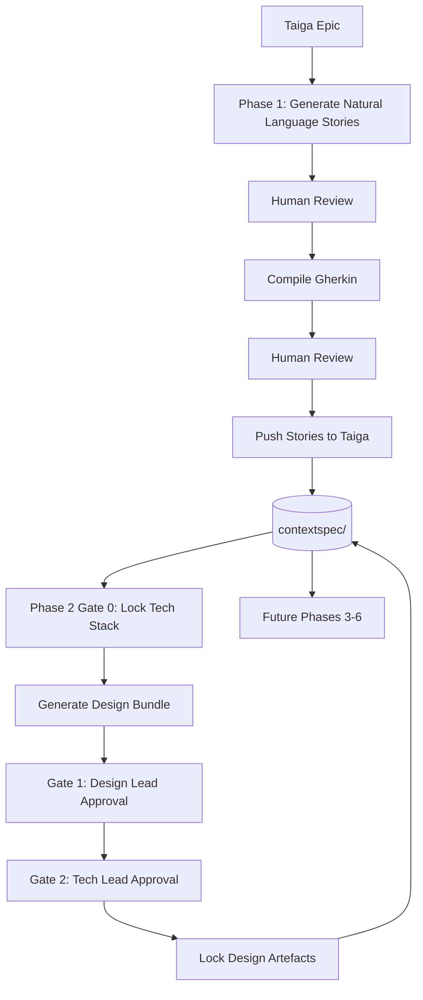

# Apex

Apex is an academic AI-guided SDLC tool that combines a **Spec-Anchored workflow**, **Claude AI**, and **Taiga**. The app helps a team move from product requirements into design artefacts while keeping the important project context in persistent, human-readable files.

The current migrated version is a split full-stack web app:

- **Backend:** Python 3.12, FastAPI, Pydantic v2, LangChain, Anthropic Claude
- **Frontend:** Next.js 15 App Router, TypeScript, React Query 5, Zustand, Tailwind CSS
- **Storage:** `contextspec/` folder in Azure File Share in deployment
- **Deployment:** GitHub Actions builds Docker images and deploys to Azure Container Apps

Phases 1 and 2 are implemented. Phases 3 to 6 currently exist as navigation placeholders.

---

## Implemented Workflow



### Phase 1 · Requirements

Phase 1 turns Taiga epics into approved user stories and Gherkin acceptance criteria.

Implemented:

- Load existing Taiga epics
- Create a new epic or use an existing one
- Ask Claude to suggest epics from the project concept
- Generate Natural Language story drafts
- Review and edit drafts before formalization
- Compile reviewed drafts into Gherkin
- Review and edit compiled Gherkin
- Push approved stories to Taiga
- Persist approved Gherkin into `functional-spec.md`
- Update `story-index.json` with `gherkin_locked` state

### Phase 2 · Design

Phase 2 creates a unified project-wide design **draft** from all locked Phase 1 stories.
All generated artefacts are AI suggestions — starting points for team review, not final deliverables.
The Design Lead and Tech Lead must review, edit if needed, and explicitly sign off before anything is locked.

Implemented:

- Gate 0: propose and lock a project-wide tech stack into `tech-stack.md`
- Generate a design draft in 4 sequential AI steps (each step uses previous sections as context for consistency):
  1. ASCII wireframes — screen-by-screen mockups for every story
  2. Mermaid user flow — navigation paths referencing the wireframe screens
  3. Component/module tree — frontend and backend structure aligned to the flows
  4. OpenAPI + DB schema — API spec and DDL consistent with the component tree
- Results appear incrementally in the UI as each step completes (~30–90 s each)
- Export the full draft as a Markdown file for offline review
- Gate 1: Design Lead sign-off (screens & flows)
- Gate 2: Tech Lead sign-off (architecture & specs)
- Persist locked artefacts into:
  - `technical-spec.md`
  - `design-bundle.md`
  - `tech-stack.md`
  - `story-index.json`
- Transition Taiga stories to design-ready status (browser-side, no backend Taiga calls)

### Sidebar Workspace

The sidebar is the operational shell for the app.

Implemented:

- Taiga login using username/password or bearer token (browser-direct, no backend proxy)
- Project selector
- Project create/delete
- Epics and stories board (fetched directly from Taiga API in the browser)
- Epic/story create, edit, delete
- Users and roles management
- Active context file viewer/editor
- Individual context file download
- ZIP download of all context files
- Story index rebuild with out-of-sync warning
- Context reset (individual and all files)
- AI model selector (fast model / coder model)
- Light/dark mode

---

## Repository Structure

| Path | Purpose |
|---|---|
| `backend/app/main.py` | FastAPI entrypoint, CORS, body limit middleware, router registration |
| `backend/app/api/phase1.py` | Phase 1 HTTP routes |
| `backend/app/api/phase2.py` | Phase 2 HTTP routes |
| `backend/app/api/workspace.py` | Sidebar/workspace routes: auth, projects, board, users, context files, AI config |
| `backend/app/api/deps.py` | FastAPI request/auth dependencies |
| `backend/app/services/` | Service layer for phase workflows, AI, Taiga, and context operations |
| `backend/app/schemas/` | Pydantic request/response models |
| `src/ai_engine.py` | Claude prompts, structured outputs, model selection, AI error handling |
| `src/context_manager.py` | Context file templates, readers/writers, story index, phase context selection |
| `src/storage.py` | Storage abstraction over local disk or Azure File Share SDK |
| `src/taiga_adapter.py` | Taiga web URL derivation for the config endpoint (minimal; all Taiga REST calls are browser-side) |
| `frontend/app/` | Next.js routes |
| `frontend/components/` | App shell, sidebar, Phase 1 workflow, Phase 2 workflow, UI components |
| `frontend/lib/api/taiga-direct.ts` | Browser-side Taiga REST client — all CRUD, auth, and story transitions |
| `frontend/lib/api/` | Typed frontend API clients |
| `frontend/lib/hooks/` | React Query hooks |
| `frontend/lib/stores/` | Zustand stores for session, UI, and Phase 2 draft state |
| `.github/workflows/ci.yml` | Test, build, push, and deploy workflow |
| `.github/workflows/scale-scheduler.yml` | Azure Container Apps scale up/down scheduler |

---

## Context Files

Apex stores workflow state in context files under `contextspec/<taiga_project_id>/`.

| File | Purpose |
|---|---|
| `project-concept.md` | Project purpose, target users, and core value proposition |
| `tech-stack.md` | Tech stack, architecture principles, and design decisions |
| `functional-spec.md` | Locked Gherkin acceptance criteria from Phase 1 |
| `technical-spec.md` | Locked technical specs from Phase 2 |
| `design-bundle.md` | Locked wireframes, user flows, component trees, and technical bundles |
| `vaccines.md` | Future bug-resolution memory for Phase 6 |
| `story-index.json` | Machine-readable story phase state |

Each Taiga project gets its own context directory. The backend reads `X-Taiga-Project-Id` on each request and uses that project ID to select the correct context folder.

Storage behavior:

- Without Azure env vars, files are stored locally in `contextspec/`.
- With `AZURE_STORAGE_CONNECTION_STRING`, `src/storage.py` uses the Azure File Share SDK.
- In Azure Container Apps, the intended deployment model is to mount the Azure File Share at `/app/contextspec` for the backend.

For normal local development, leave Azure storage blank unless you deliberately want to share context with the deployed app.

---

## Local Development

### Requirements

- Python 3.12
- Node.js 20+
- npm
- Docker, optional
- Anthropic API key
- Taiga account

### Environment

Create `.env` in the repository root:

```env
ANTHROPIC_API_KEY=sk-ant-...

TAIGA_API_URL=https://api.taiga.io

# Optional. Leave blank for local contextspec/ storage.
AZURE_STORAGE_CONNECTION_STRING=
AZURE_FILE_SHARE_NAME=contextspec

# Optional. Comma-separated frontend origins allowed by FastAPI CORS.
ALLOWED_ORIGINS=http://localhost:3000

# Optional LangSmith tracing.
LANGCHAIN_TRACING_V2=
LANGCHAIN_API_KEY=
LANGCHAIN_PROJECT=apex

# Used by Docker/Next build.
NEXT_PUBLIC_API_BASE_URL=http://localhost:8000
```

Do not commit `.env`.

### Run Backend

```bash
pip install -r requirements.txt
uvicorn backend.app.main:app --reload --host 0.0.0.0 --port 8000
```

Health check:

```bash
curl http://localhost:8000/api/health
```

### Run Frontend

```bash
cd frontend
npm ci
npm run dev
```

Open:

- Frontend: `http://localhost:3000`
- Backend: `http://localhost:8000`

### Run With Docker Compose

```bash
docker compose up --build
```

Docker Compose starts:

- backend on `http://localhost:8000`
- frontend on `http://localhost:3000`

The compose file mounts local `./contextspec` into the backend container at `/app/contextspec`.

Stop:

```bash
docker compose down
```

---

## Tests

Backend:

```bash
python3 -m pytest tests/ -v --tb=short
```

Frontend:

```bash
cd frontend
npm ci
npm run lint
npm run typecheck
npm test
npm run build
```

CI runs:

- backend: ruff lint, pytest
- frontend: ESLint, typecheck, Vitest, production build
- backend/frontend Docker builds and pushes
- post-deploy health check (`/api/health`)

---

## Deployment

Deployment is handled by GitHub Actions in `.github/workflows/ci.yml`.

The workflow runs on:

- push to `main`
- pull request to `main`

On pull requests, it runs tests and builds images without pushing or deploying.

On push to `main`, it:

1. Runs backend tests.
2. Runs frontend typecheck, unit tests, and build.
3. Builds the backend image from `backend/Dockerfile`.
4. Builds the frontend image from `frontend/Dockerfile`.
5. Pushes both images to GitHub Container Registry.
6. Updates Azure Container Apps to the new image tags.
7. Polls `/api/health` for up to 2 minutes to confirm the backend came up.

### Container Apps

Azure resources in `apex-rg`:

| Resource | Type | Purpose |
|---|---|---|
| `apex-backend` | Container App | FastAPI API on port 8000 |
| `apex-frontend` | Container App | Next.js app on port 3000 |
| `apex-env` | Container Apps Environment | Shared CA environment |
| `apex-logs` | Log Analytics workspace | Container log sink |
| `apexctxstore` | Storage account | Azure File Share for context files |

The workflow uses:

```env
AZURE_RESOURCE_GROUP=apex-rg
AZURE_LOCATION=francecentral
REGISTRY=ghcr.io
IMAGE_NAME=${{ github.repository }}
```

The deployed image tags use the short Git SHA:

- `ghcr.io/<owner>/<repo>-backend:sha-xxxxxxx`
- `ghcr.io/<owner>/<repo>-frontend:sha-xxxxxxx`


### Azure File Share Mount

The backend Docker image creates `/app/contextspec`.

In Azure, mount the `contextspec` Azure File Share into:

```text
/app/contextspec
```

Only the backend needs the mount. The frontend does not read or write context files directly.

If both the Azure SDK env vars and the file-share mount are present, the code path uses the Azure SDK because `AZURE_STORAGE_CONNECTION_STRING` is set. For the cleanest Container Apps setup, prefer one model:

- **Mounted share model:** mount the share and leave `AZURE_STORAGE_CONNECTION_STRING` empty.
- **SDK model:** set `AZURE_STORAGE_CONNECTION_STRING` and do not depend on the volume mount.

The current code supports both local disk and SDK mode. The mount model is simpler for Container Apps because it behaves like normal filesystem access.

---

## Scale Scheduler

The scheduler is defined in `.github/workflows/scale-scheduler.yml`.

Purpose: reduce Azure cost for an academic/demo deployment by scaling both Container Apps down when not in use and scaling them back up during the day.

It controls:

- `apex-backend`
- `apex-frontend`

Schedules are UTC-based because GitHub Actions cron uses UTC:

| Cron | Action | Result |
|---|---|---|
| `0 8 * * *` | Scale up | backend/frontend `min=1`, `max=10` |
| `0 22 * * *` | Scale down | backend/frontend `min=0`, `max=1` |

Manual dispatch is also supported:

- `up`: sets both apps to `min=1`, `max=10`
- `down`: sets both apps to `min=0`, `max=1`

Portugal time note:

- During WET, `08:00 UTC` is `08:00` in Lisbon and `22:00 UTC` is `22:00`.
- During WEST, `08:00 UTC` is `09:00` in Lisbon and `22:00 UTC` is `23:00`.

This one-hour seasonal drift is acceptable for the project. If exact Lisbon local time is required, split the scheduler into separate DST-aware cron periods or trigger scaling from Azure Automation/Logic Apps with timezone support.

### Cold Starts

When scaled down to `min=0`, both frontend and backend can cold start. The first request after scale-up/down may be slower. This is expected.

---

## Current Phase Status

| Phase | Status |
|---|---|
| Phase 1 · Requirements | Implemented |
| Phase 2 · Design | Implemented |
| Phase 3 · Implementation | Placeholder |
| Phase 4 · Testing | Placeholder |
| Phase 5 · Deployment | Placeholder |
| Phase 6 · Maintenance | Placeholder |

Phase 3 is expected to be an academic implementation-planning workflow, not a real code-writing agent. A likely shape is:

- select stories with locked technical specs
- generate implementation task breakdowns
- generate developer handoff/proposal documents
- optionally create Taiga tasks
- persist proposals into context files
- update `story-index.json` with implementation readiness state

---

## Architecture Note — Taiga Calls Are Browser-Side

All Taiga REST API calls (login, projects, epics, stories, users, story transitions) are made directly from the user's browser via `frontend/lib/api/taiga-direct.ts`. The FastAPI backend never connects to Taiga.

**Why:** Azure Container Apps Consumption tier uses shared egress IPs that are blocked by `api.taiga.io` at the TCP level. Moving all Taiga calls to the browser bypasses this entirely and also removes a latency hop.

**Implication:** `src/taiga_adapter.py` is now a stub that only derives the Taiga web URL from `TAIGA_API_URL` for the `GET /config` endpoint. Do not add new backend-to-Taiga calls.

---

## Notes For Future Maintainers

- Keep routers thin and put workflow logic in `backend/app/services/`.
- Keep Claude prompt logic in `src/ai_engine.py`.
- All Taiga REST calls go through `frontend/lib/api/taiga-direct.ts` in the browser. Do not proxy Taiga through the backend.
- Treat Markdown context files as human-readable artefacts, and `story-index.json` as the machine-readable workflow index.
- The backend runs with `--workers 2` in Docker so concurrent AI calls don't block each other.
- AI errors map to distinct HTTP codes: `AIRateLimitError` → 429, `AITimeoutError` → 504, generic `AIError` → 502.
- Do not commit local `contextspec/`, `.env`, `.next`, `node_modules`, or Python cache files.
