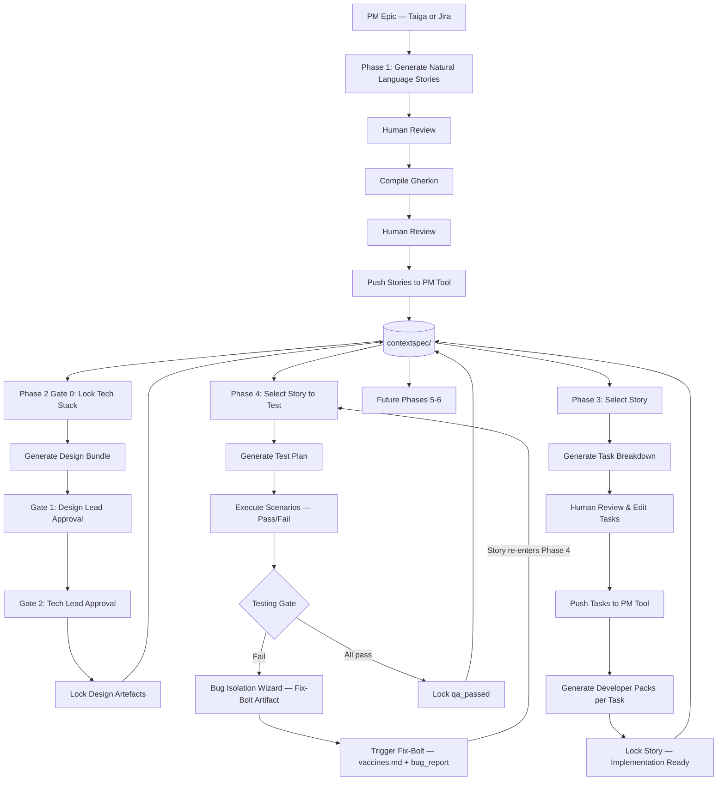

# Apex

Apex is an academic AI-guided SDLC tool that combines a **Spec-Anchored workflow**, **Claude AI**, **Taiga or Jira** as project management backend, and optional **GitHub** repository context. The app helps a team move from product requirements into design artefacts while keeping the important project context in persistent, human-readable files.

The current migrated version is a split full-stack web app:

- **Backend:** Python 3.12, FastAPI, Pydantic v2, LangChain, Anthropic Claude / OpenAI GPT / Google Gemini
- **Frontend:** Next.js 15 App Router, TypeScript, React Query 5, Zustand, Tailwind CSS
- **Storage:** `contextspec/` folder in Azure File Share in deployment
- **Deployment:** GitHub Actions builds Docker images and deploys to Azure Container Apps

Phases 1, 2, 3, and 4 are implemented. Phases 5 and 6 currently exist as navigation placeholders.

---

## Implemented Workflow



### Phase 1 · Requirements

Phase 1 turns PM epics into approved user stories and Gherkin acceptance criteria. Works with both Taiga and Jira Cloud via the PM adapter layer.

Implemented:

- Load existing epics from Taiga or Jira
- Create a new epic or use an existing one
- Ask Claude to suggest epics from the project concept
- Generate Natural Language story drafts
- Review and edit drafts before formalization
- Compile reviewed drafts into Gherkin
- Review and edit compiled Gherkin
- Push approved stories to the connected PM tool
- Persist approved Gherkin into `functional-spec.md`
- Update `story-index.json` with `gherkin_locked` state

### Phase 2 · Design

Phase 2 creates a unified project-wide design **draft** from all locked Phase 1 stories.
All generated artefacts are AI suggestions — starting points for team review, not final deliverables.
The Design Lead and Tech Lead must review, edit if needed, and explicitly sign off before anything is locked.

Implemented:

- Gate 0: propose and lock a project-wide tech stack into `tech-stack.md`
- Generate a **Screen Inventory** or **Component Spec** (user-selectable toggle) as Step 1 — either a per-screen UI summary grouped by epic, or an Atomic Design component catalog (atoms → molecules → organisms) with props, states, and usage context
- Generate a **design bundle** in a 3-section AI cascade (each section uses previous output as context for consistency):
  1. **UX Brief** — user flows, navigation paths, and interaction patterns referencing Step 1
  2. **Endpoints** — API surface with auth, request/response contracts (`METHOD /path · auth · in:{} · out:{}`)
  3. **Data Model** — entities, fields, and relations consistent with the endpoint contracts
- All sections are editable in-place before locking
- Results appear incrementally as each section completes
- Each section has a collapsible visualization panel — auto-generated when the section completes, persisted so it loads instantly on return:
  - **UX Brief → Screen Flow** (React Flow) — screens as nodes, navigation actions as labelled directed edges; dagre left-to-right auto-layout; drag to rearrange; layout saved to `diagram-screens.json`
  - **Endpoints → API Surface** — client-side parse of the endpoint markdown; groups by resource; at the top a method distribution summary — color-coded pill counts (GET green, POST blue, PUT/PATCH amber, DELETE red) with a proportional stacked bar showing API shape at a glance; each endpoint row is an accordion — collapsed shows method badge, path, and auth; expanded reveals request and response fields as typed key:type pills (e.g. `username:string`); zero AI cost
  - **Data Model → ER Diagram** (React Flow) — entities as cards with field types; primary keys amber, foreign keys blue; dagre auto-layout; drag to rearrange; layout saved to `diagram-er.json`
- Export the full draft as a Markdown file for offline review
- Gate 1: Design Lead sign-off (screens & flows)
- Gate 2: Tech Lead sign-off (architecture & specs)
- Persist locked artefacts into:
  - `technical-spec.md`
  - `design-bundle.md`
  - `tech-stack.md`
  - `story-index.json`
- Transition stories to design-ready status in the PM tool (browser-side, no backend PM calls)
- GitHub repository context (`github-context.md`) is injected into AI prompts when available

### Phase 3 · Implementation Assist

Phase 3 turns locked design artefacts into actionable developer tasks and coding proposals.
It operates story-by-story: only stories with `design_locked` status are eligible.

Implemented — 4-stage stepper workflow:

**Stage A — Select Story**

- Filter by epic from a dropdown
- Browse eligible stories in a 2×2 paged card grid (Prev/Next navigation)
- Each card shows a Gherkin scenario preview and the story title

**Stage B — Generate Tasks**

- View the full Gherkin spec for the selected story
- Ask the AI to decompose the story into developer implementation tasks (subject + description each)
- Review and edit the generated task list before proceeding; add or remove tasks manually

**Stage C — Developer Packs**

- Push all tasks to the PM tool as subtasks (browser-direct); each task gets a PM ref
- For each task, generate a **Developer Pack** — a structured Markdown coding proposal including context, approach, and acceptance checklist; GitHub repository context is injected when available
- View and edit packs in an in-browser editor; re-generate any pack if needed
- Packs are auto-saved to `proposal_story_<id>_task_<id>.md` in `contextspec/`

**Stage D — Lock**

- Lock the story into `implementation` status; all task packs must be saved before locking is allowed
- Export all developer packs for the story as a single ZIP download
- Updates `story-index.json` with `has_proposal: true` and `phase_status: "implementation"`

### Phase 4 · Testing

Phase 4 is the QA validation playbook. It operates story-by-story on stories with `implementation` status and provides AI-assisted test plan generation, manual scenario execution tracking, and a bug isolation wizard.

Implemented — 4-stage stepper workflow:

**Stage A — Select Story**

- Filter eligible stories (`implementation` status) grouped by epic; 2×2 paged card grid
- Each card shows: story ID badge, Gherkin scenario preview, "Plan ready" badge if a test plan is already saved, and "Regression Bypass" badge for stories re-entering after a Fix-Bolt cycle

**Stage B — Test Plan**

- Breadcrumb: Stories → Epic → US#ID Story Title
- Acceptance Criteria (Gherkin) panel expanded by default
- Implementation Tasks list — each task shows effort estimate badge (XS–XL), subject, and description
- AI generates a full per-scenario test plan: Test Steps, Expected Results, Edge Cases, Risk Areas for each Gherkin scenario
- Edit the generated test plan in a monospace textarea before saving
- Download `.md` / Copy actions
- Save & Continue → Stage C (saves to `bdd_story_{id}.feature`)

**Stage C — Execute Tests**

- Progress bar: X / Y scenarios marked
- Per-scenario cards with **Pass** / **Fail** toggle buttons; colour-coded (green / red)
- Fail → inline notes textarea expands for reproduction steps and observed vs expected behaviour
- Expandable "View test steps" per scenario (collapsible section from the test plan)
- Regression Bypass mode: amber banner shown; previously failed scenarios highlighted in amber
- All scenarios must be marked before proceeding to the Testing Gate

**Stage D — Testing Gate**

- Summary card: all pass (green) or N failed (red, with list of failing scenario names)
- **Pass path:** lock story to `qa_passed` status → optional PM story status update → "Test Another Story"
- **Fail path → Bug Isolation Wizard:**
  - AI analyses all failed scenarios + QA notes to generate a **Fix-Bolt artifact**: Bug Summary, Failed Scenario, Root Cause Hypothesis, Patch Scope, Reproduction Steps, Fix-Bolt Brief
  - Preview in monospace panel; Download `.md` / Copy Fix-Bolt Brief
  - **Trigger Fix-Bolt:** saves `bug_report_{id}.md`, appends `vaccines.md`, marks story with `has_bug_report`; story returns to `implementation` and re-enters Phase 4 as Regression Bypass on next select

### Sidebar Workspace

The sidebar is the operational shell for the app.

Implemented:

- PM tool selector — toggle between Taiga (violet) and Jira Cloud (blue) before signing in; connected Taiga private cloud URL shown under account when non-default
- **Taiga login** — username/password or bearer token; all Taiga API calls are proxied through the FastAPI backend (`/api/pm/taiga/{path}`) — supports Taiga Cloud and private/self-hosted instances (e.g. `https://taiga.yourcompany.com`)
- **Jira Cloud login** — domain, Atlassian account email, and API token; auth is verified through the FastAPI backend proxy before the session is stored
- Project selector
- Project create/delete
- Epics and stories board (fetched directly from Taiga or Jira API in the browser); filter by text across epics and stories
- Epic/story create, edit, delete
- **Task Board** — view implementation tasks grouped by story; tasks are fetched from Taiga (or Jira) and merged with locally generated JSON; filter by epic/story; add, edit, and delete tasks inline; effort badges (XS → XL)
- Users and roles management
- Active context file viewer/editor
- Individual context file download
- ZIP download of all context files
- Story index rebuild with out-of-sync warning
- Context reset (individual and all files)
- **GitHub integration** — connect a GitHub repository via a Personal Access Token (`repo` scope); displays repo name, description, primary language, star count, default branch, and public/private badge; **Sync Context** fetches the repo's file tree, README, primary config file (`package.json` / `requirements.txt` / `pyproject.toml`), and OpenAPI spec (if present) and writes them to `github-context.md`; synced context is automatically injected into Phase 2 and Phase 3 AI prompts; GitHub API calls are made browser-side (no backend proxy needed)
- AI model selector — single unified selector used across all phases; supports Anthropic (Claude), OpenAI (GPT), and Google (Gemini); budget-tier to premium options per provider; provider warnings shown when the corresponding API key is absent from the backend
- Draggable sidebar sections — each panel can be reordered by drag-and-drop; order is persisted per session
- Light/dark mode

---

## Repository Structure

| Path | Purpose |
|---|---|
| `backend/app/main.py` | FastAPI entrypoint, CORS, body limit middleware, router registration |
| `backend/app/api/phase1.py` | Phase 1 HTTP routes |
| `backend/app/api/phase2.py` | Phase 2 HTTP routes |
| `backend/app/api/phase3.py` | Phase 3 HTTP routes |
| `backend/app/api/phase4.py` | Phase 4 HTTP routes |
| `backend/app/api/workspace.py` | Sidebar/workspace routes: auth, projects, board, users, context files, AI config |
| `backend/app/api/taiga_proxy.py` | FastAPI reverse proxy for all Taiga REST calls — SSRF-guarded, header-injection-safe, forwards `DELETE/GET/PATCH/POST/PUT /api/pm/taiga/{path}` to the configured Taiga instance |
| `backend/app/api/jira_proxy.py` | FastAPI reverse proxy for Jira Cloud REST API v3 (Basic auth, SSRF-guarded to `*.atlassian.net`) |
| `backend/app/api/deps.py` | FastAPI request/auth dependencies |
| `backend/app/services/` | Service layer for phase workflows, AI, Taiga, and context operations |
| `backend/app/schemas/` | Pydantic request/response models |
| `src/ai_engine.py` | Claude prompts, structured outputs, model selection, AI error handling |
| `src/context_manager.py` | Context file templates, readers/writers, story index, phase context selection |
| `src/storage.py` | Storage abstraction over local disk or Azure File Share SDK |
| `src/taiga_adapter.py` | Taiga web URL derivation for the config endpoint (minimal stub; all Taiga REST calls go through `taiga_proxy.py`) |
| `frontend/app/` | Next.js routes |
| `frontend/components/` | App shell, sidebar, Phase 1–4 workflow components, UI primitives |
| `frontend/lib/api/taiga-direct.ts` | Taiga REST client — all CRUD, auth, and story transitions; sends requests to the FastAPI Taiga proxy with `X-Taiga-Url` header |
| `frontend/lib/api/pm-types.ts` | `ProjectManagementAdapter` interface and shared PM types |
| `frontend/lib/api/pm-factory.ts` | `getPmAdapter(pmTool)` dispatcher — returns Taiga or Jira adapter |
| `frontend/lib/api/taiga-adapter.ts` | Taiga adapter wrapping `taiga-direct.ts` |
| `frontend/lib/api/jira-adapter.ts` | Jira Cloud adapter — REST v3, ADF, paginated JQL, two-step transitions |
| `frontend/lib/api/github-browser.ts` | Browser-side GitHub REST client — repo metadata, file tree, README, config file, and OpenAPI spec fetching for context sync |
| `frontend/lib/api/` | Typed frontend API clients for all phases |
| `frontend/lib/hooks/` | React Query hooks for all phases |
| `frontend/lib/stores/` | Zustand stores for session, UI, and per-phase draft state |
| `.github/workflows/ci.yml` | Test, build, push, and deploy workflow |
| `.github/workflows/scale-scheduler.yml` | Azure Container Apps scale up/down scheduler |

---

## Context Files

Apex stores workflow state in context files under `contextspec/<taiga_project_id>/`.

| File | Purpose |
|---|---|
| `project-concept.md` | Project purpose, target users, and core value proposition |
| `tech-stack.md` | Tech stack, architecture principles, and design decisions |
| `functional-spec.md` | Locked Gherkin acceptance criteria from Phase 1 |
| `technical-spec.md` | Locked technical specs from Phase 2 |
| `design-bundle.md` | Locked wireframes, user flows, component trees, and technical bundles |
| `diagram-screens.json` | React Flow screen flow diagram generated from Phase 2 UX Brief (includes saved layout positions) |
| `diagram-er.json` | React Flow ER diagram generated from Phase 2 Data Model (includes saved layout positions) |
| `github-context.md` | Repo file tree, README, config file, and OpenAPI spec synced from GitHub; injected into Phase 2 and Phase 3 AI prompts |
| `proposal_story_<id>_task_<id>.md` | Developer pack generated by Phase 3 for each task |
| `bdd_story_<id>.feature` | Test plan generated by Phase 4 for each story |
| `bug_report_<id>.md` | Fix-Bolt artifact generated by Phase 4 when a story fails the Testing Gate |
| `vaccines.md` | Appended with each Fix-Bolt record — bug isolation log for future reference |
| `story-index.json` | Machine-readable story phase state |

Each Taiga project gets its own context directory. The backend reads `X-Taiga-Project-Id` on each request and uses that project ID to select the correct context folder.

Storage behavior:

- Without Azure env vars, files are stored locally in `contextspec/`.
- With `AZURE_STORAGE_CONNECTION_STRING`, `src/storage.py` uses the Azure File Share SDK.
- In Azure Container Apps, the intended deployment model is to mount the Azure File Share at `/app/contextspec` for the backend.

For normal local development, leave Azure storage blank unless you deliberately want to share context with the deployed app.

---

## Local Development

### Requirements

- Python 3.12
- Node.js 20+
- npm
- Docker, optional
- Anthropic API key
- Taiga account (or Jira Cloud account — at least one required)
- GitHub Personal Access Token, optional (for repository context enrichment)

### Environment

Create `.env` in the repository root:

```env
ANTHROPIC_API_KEY=sk-ant-...

TAIGA_API_URL=https://api.taiga.io

# Optional — only needed if using OpenAI models in the AI model selector.
OPENAI_API_KEY=

# Optional — only needed if using Google Gemini models in the AI model selector.
GOOGLE_API_KEY=

# Optional. Leave blank for local contextspec/ storage.
AZURE_STORAGE_CONNECTION_STRING=
AZURE_FILE_SHARE_NAME=contextspec

# Optional. Comma-separated frontend origins allowed by FastAPI CORS.
ALLOWED_ORIGINS=http://localhost:3000

# Optional LangSmith tracing.
LANGCHAIN_TRACING_V2=
LANGCHAIN_API_KEY=
LANGCHAIN_PROJECT=apex

# Used by Docker/Next build.
NEXT_PUBLIC_API_BASE_URL=http://localhost:8000
```

Do not commit `.env`.

### Run Backend

```bash
pip install -r requirements.txt
uvicorn backend.app.main:app --reload --host 0.0.0.0 --port 8000
```

Health check:

```bash
curl http://localhost:8000/api/health
```

### Run Frontend

```bash
cd frontend
npm ci
npm run dev
```

Open:

- Frontend: `http://localhost:3000`
- Backend: `http://localhost:8000`

### Testing Against a Private Taiga Instance

Use this to verify Apex works correctly against a self-hosted Taiga deployment (e.g. `taiga.yourcompany.com`) before going to production.

#### 1. Run a local Taiga instance via Docker

```bash
git clone https://github.com/taigaio/taiga-docker ~/taiga-docker
cd ~/taiga-docker
cp .env.example .env   # defaults work for localhost:9000
# Edit .env: set ENABLE_TELEMETRY=False
docker compose up -d
```

Run DB migrations and create an admin user:

```bash
bash taiga-manage.sh migrate
docker compose -f docker-compose.yml -f docker-compose-inits.yml run --rm taiga-manage shell -c "
from django.apps import apps; User = apps.get_model('users','User')
User.objects.create_superuser('admin','admin@localhost.com','yourpassword')
"
```

Taiga is now accessible at `http://localhost:9000`.

#### 2. Expose Taiga with a public HTTPS URL (Cloudflare Tunnel)

The Apex backend proxy requires `https://` for all Taiga URLs. Use a Cloudflare quick tunnel to get one without a domain or account:

```bash
# Install cloudflared (one-time)
curl -L https://github.com/cloudflare/cloudflared/releases/latest/download/cloudflared-linux-amd64 -o /tmp/cloudflared
chmod +x /tmp/cloudflared && sudo mv /tmp/cloudflared /usr/local/bin/cloudflared

# Start tunnel (run while testing — URL changes on each restart)
cloudflared tunnel --url http://localhost:9000
```

The tunnel prints a URL like `https://xxxx-xxxx.trycloudflare.com`. Use that as the Taiga instance URL in Apex.

#### 3. Configure Apex

In `.env`, leave `APEX_ALLOW_HTTP_LOCALHOST` blank (not needed when using the tunnel URL).

In the Apex sidebar:
- PM tool: **Taiga**
- Taiga instance URL: `https://xxxx-xxxx.trycloudflare.com`
- Username / password: your Taiga admin credentials

#### Stop

```bash
cd ~/taiga-docker && docker compose down
```

---

### Run With Docker Compose

```bash
docker compose up --build
```

Docker Compose starts:

- backend on `http://localhost:8000`
- frontend on `http://localhost:3000`

The compose file mounts local `./contextspec` into the backend container at `/app/contextspec`.

Stop:

```bash
docker compose down
```

---

## Tests

### Backend (pytest)

```bash
python3 -m pytest tests/ -v --tb=short
```

Coverage:

- `tests/test_backend_phase1.py` — Phase 1 service-layer unit tests
- `tests/test_backend_phase2.py` — Phase 2 service-layer unit tests; AI cascade, design section generation, persist-design flow
- `tests/test_backend_phase2_api.py` — Phase 2 HTTP route tests; stub service, error-code mapping
- `tests/test_backend_phase3.py` — Phase 3 service-layer unit tests; task generation, proposal generation, hint/cross-task context passthrough
- `tests/test_backend_phase3_api.py` — Phase 3 HTTP route tests; all 9 endpoints, error-code mapping (422/429/504)
- `tests/test_taiga_proxy.py` — 19 tests covering Taiga proxy routing, SSRF blocking, header injection guard, method forwarding
- `tests/test_deps.py` — 10 tests covering FastAPI dependency utilities (`deps.py`)

`AzureFileShareService` is mocked at the service boundary via a `ctx` fixture in `conftest.py`. No real Azure credentials or live backend needed to run the suite.

### Frontend (Vitest)

```bash
cd frontend
npm ci
npm run lint
npm run typecheck
npm test
npm run build
```

Coverage: React Query hooks, Taiga direct API calls, session store, API client utilities.

### Frontend E2E (Playwright)

```bash
cd frontend
npx playwright install --with-deps chromium   # first time only
npm run test:e2e
npm run test:e2e:ui                           # with interactive UI
```

Three spec files, each exercising one full phase flow against mocked backend and Taiga APIs:

**`e2e/phase1-story-flow.spec.ts`**

1. Navigate to `/phase1`
2. Fill epic title → click **Generate Stories** (mocks `/api/phase1/generate-nl-stories`)
3. Wait for **Convert to Acceptance Criteria** to be enabled → click
4. Assert the first gherkin textarea contains `Feature: User Login` (mocks `/api/phase1/compile-gherkin`)
5. Assert **Push Stories** enabled → click (mocks `/api/phase1/finalize-stories`)
6. Assert `stories pushed and locked` confirmation

**`e2e/phase2-design-flow.spec.ts`**

1. Navigate to `/phase2`
2. Click **Propose Architecture** (mocks `/api/phase2/propose-tech-stack`) → two alternatives appear
3. Click first alternative card → click **Save Technology Choices** (mocks `/api/phase2/lock-tech-stack`, stateful: sets `techStackDefined=true`)
4. Assert `Technology choices saved` toast
5. Wait for **Generate Design** to appear (status query refetches and returns `defined: true`)
6. Click **Generate Design** — three-section cascade (mocks `/api/phase2/generate-design-section` three times sequentially for `ux_brief`, `endpoints`, `data_model`)
7. Assert `Login screen` text visible in UX Brief section
8. Wait for sign-off panel → check **Design Lead Sign-off** and **Tech Lead Sign-off** checkboxes
9. Click **Save & Lock Design** (mocks `/api/phase2/persist-design`)
10. Assert `Design locked for` toast/callout

**`e2e/phase3-pack-flow.spec.ts`**

1. Navigate to `/phase3`
2. Assert `User Login` story card visible (mocks `/api/phase3/eligible-stories`)
3. Click story card → Stage B — wait for **Generate Tasks** enabled (story context loads via `/api/phase3/story-context/10`)
4. Click **Generate Tasks** (mocks `/api/phase3/generate-tasks`) → two tasks appear
5. Click **Developer Packs** → Stage C
6. Click task `Create User model and migration` to select it
7. Click **Generate Pack** (mocks `/api/phase3/generate-proposal`) → pack markdown appears
8. Click **Agentic Brief** copy button → assert `Agentic Brief copied.` toast (clipboard permission granted)
9. Click **Continue to Lock** → Stage D
10. Click **Lock Story** (mocks `/api/phase3/lock-story`, `canLock` requires `covered_scenarios` matches gherkin scenario names)
11. Assert **Export All Packs** button visible

#### Mock infrastructure

All mocks live in `frontend/e2e/mocks/handlers.ts` and are applied via `page.route()` (Chromium-level interception). No real server is required.

Key design decisions:

| Decision | Reason |
|---|---|
| `page.route()` instead of MSW Node | Browser fetch is not intercepted by Node-level MSW; `page.route()` intercepts at the Chromium network layer |
| Catch-all `workspace/**` registered first | Playwright matches last-registered handler first; specific routes registered after override the catch-all |
| Stateful `mockState.techStackDefined` closure | `lock-tech-stack` sets the flag so the subsequent `tech-stack-status` refetch returns `defined: true`, advancing Phase 2 from Stage A to Stage B |
| Empty task list from `task-list` mock | Returning pre-existing tasks triggers `hydrateFromBackend` which sets `tasksPushed: true`, disabling **Generate Tasks**; empty list keeps it enabled |
| `covered_scenarios: ["Successful login"]` | Must match the exact scenario name from `parseGherkinScenarios()`; using the story title instead keeps `coverageOk: false` and disables **Lock Story** |
| Zustand hydration via `addInitScript` | Sets `apex-session` (v5) in `sessionStorage` and `apex-phase3-draft` in localStorage before first navigation so components see a valid token and project ID on first render |
| Clipboard permission grant | `navigator.clipboard.writeText()` is blocked headless without explicit permission; granted via `page.context().grantPermissions()` |

Mocked endpoints (`http://localhost:8000` — all Taiga calls now go through the backend proxy, not directly to `api.taiga.io`):

- `/api/health`, all `/api/workspace/**` routes
- Phase 1: `generate-nl-stories`, `compile-gherkin`, `finalize-stories`
- Phase 2: `tech-stack-status` (stateful), `propose-tech-stack`, `lock-tech-stack`, `generate-design-section`, `persist-design`, `diagram`, `generate-diagram`, `screen-flow`, `generate-screen-flow`, `refresh-story-index`
- Phase 3: `eligible-stories`, `story-context/**`, `generate-tasks`, `generate-proposal`, `save-proposal`, `task-list/**`, `proposals/**`, `lock-story`, `task-board`, `missing-task-lists`
- Taiga: `/users/me`, `/memberships**`, `/roles**`, `/tasks**`, `/epics**`, `/userstories**`, `/projects**`

CI runs:

- backend: ruff lint, pytest
- frontend: ESLint, typecheck, Vitest (`npm test`), production build
- frontend E2E: Playwright chromium (`npm run test:e2e`) — runs after Vitest, gates Docker builds
- backend/frontend Docker builds and pushes
- post-deploy health check (`/api/health`)

---

## Deployment

Deployment is handled by GitHub Actions in `.github/workflows/ci.yml`.

The workflow runs on:

- push to `main`
- pull request to `main`

On pull requests, it runs tests and builds images without pushing or deploying.

On push to `main`, it:

1. Runs backend tests.
2. Runs frontend typecheck, unit tests, and build.
3. Builds the backend image from `backend/Dockerfile`.
4. Builds the frontend image from `frontend/Dockerfile`.
5. Pushes both images to GitHub Container Registry.
6. Updates Azure Container Apps to the new image tags.
7. Polls `/api/health` for up to 2 minutes to confirm the backend came up.

### Container Apps

Azure resources in `apex-rg`:

| Resource | Type | Purpose |
|---|---|---|
| `apex-backend` | Container App | FastAPI API on port 8000 |
| `apex-frontend` | Container App | Next.js app on port 3000 |
| `apex-env` | Container Apps Environment | Shared CA environment |
| `apex-logs` | Log Analytics workspace | Container log sink |
| `apexctxstore` | Storage account | Azure File Share for context files |

The workflow uses:

```env
AZURE_RESOURCE_GROUP=apex-rg
AZURE_LOCATION=francecentral
REGISTRY=ghcr.io
IMAGE_NAME=${{ github.repository }}
```

The deployed image tags use the short Git SHA:

- `ghcr.io/<owner>/<repo>-backend:sha-xxxxxxx`
- `ghcr.io/<owner>/<repo>-frontend:sha-xxxxxxx`


### Azure File Share Mount

The backend Docker image creates `/app/contextspec`.

In Azure, mount the `contextspec` Azure File Share into:

```text
/app/contextspec
```

Only the backend needs the mount. The frontend does not read or write context files directly.

If both the Azure SDK env vars and the file-share mount are present, the code path uses the Azure SDK because `AZURE_STORAGE_CONNECTION_STRING` is set. For the cleanest Container Apps setup, prefer one model:

- **Mounted share model:** mount the share and leave `AZURE_STORAGE_CONNECTION_STRING` empty.
- **SDK model:** set `AZURE_STORAGE_CONNECTION_STRING` and do not depend on the volume mount.

The current code supports both local disk and SDK mode. The mount model is simpler for Container Apps because it behaves like normal filesystem access.

---

## Scale Scheduler

The scheduler is defined in `.github/workflows/scale-scheduler.yml`.

Purpose: reduce Azure cost for an academic/demo deployment by scaling both Container Apps down when not in use and scaling them back up during the day.

It controls:

- `apex-backend`
- `apex-frontend`

Schedules are UTC-based because GitHub Actions cron uses UTC:

| Cron | Action | Result |
|---|---|---|
| `0 8 * * *` | Scale up | backend/frontend `min=1`, `max=10` |
| `0 22 * * *` | Scale down | backend/frontend `min=0`, `max=0` |

Manual dispatch is also supported:

- `up`: sets both apps to `min=1`, `max=10`
- `down`: sets both apps to `min=0`, `max=0` (fully off)

Portugal time note:

- During WET, `08:00 UTC` is `08:00` in Lisbon and `22:00 UTC` is `22:00`.
- During WEST, `08:00 UTC` is `09:00` in Lisbon and `22:00 UTC` is `23:00`.

This one-hour seasonal drift is acceptable for the project. If exact Lisbon local time is required, split the scheduler into separate DST-aware cron periods or trigger scaling from Azure Automation/Logic Apps with timezone support.

---

## Current Phase Status

| Phase | Status |
|---|---|
| Phase 1 · Requirements | Implemented |
| Phase 2 · Design | Implemented |
| Phase 3 · Implementation | Implemented |
| Phase 4 · Testing | Implemented |
| Phase 5 · Deployment | Placeholder |
| Phase 6 · Maintenance | Placeholder |

---

## Architecture Note — Browser-Side vs Proxied API Calls

**Taiga:** All Taiga REST API calls (login, projects, epics, stories, users, story transitions) are proxied through the FastAPI backend at `DELETE/GET/PATCH/POST/PUT /api/pm/taiga/{path}` (`backend/app/api/taiga_proxy.py`). `frontend/lib/api/taiga-direct.ts` sends an `X-Taiga-Url` header carrying the user-configured Taiga base URL; the backend validates it with SSRF guards, resolves it against the saved workspace config if absent, and forwards the request server-side.

**Why server-side for Taiga:** Private/self-hosted Taiga instances (e.g. `taiga.marsshot.eu`) reject browser CORS preflight requests from third-party origins. Proxying through the backend eliminates this entirely for both self-hosted and Taiga Cloud. The proxy also adds SSRF protection (RFC-1918 / loopback block), `\r\n` header-injection guards, and a consistent place to apply future auth or rate-limit logic.

**Implication:** `src/taiga_adapter.py` is a stub that only derives the Taiga web URL for the `GET /config` endpoint. All Taiga REST traffic goes through `taiga_proxy.py` — do not add browser-direct Taiga calls.

**Jira:** Jira API calls are proxied through the FastAPI backend (`backend/app/api/jira_proxy.py`). The browser sends requests to `/api/pm/jira/*` with `X-Jira-Base-Url` and `Authorization: Basic` headers; the backend forwards them to the Jira Cloud REST API. This is required because Jira Cloud does not allow direct browser requests from arbitrary origins.

**GitHub:** GitHub REST API calls are made directly from the browser via `frontend/lib/api/github-browser.ts`. GitHub returns `Access-Control-Allow-Origin: *` so no backend proxy is needed. The GitHub PAT is excluded from session persistence and never sent to the backend.

**Session security:** The Zustand `apex-session` store (v5) persists to `sessionStorage` so credentials are cleared when the browser tab closes. The GitHub PAT is excluded from the persist partition entirely.

---

## Notes For Future Maintainers

- Keep routers thin and put workflow logic in `backend/app/services/`.
- Keep AI prompt logic in `src/ai_engine.py`. Provider is detected automatically from the model ID prefix (`claude-` → Anthropic, `gpt-`/`o1-`/`o3-` → OpenAI, `gemini-` → Google).
- All Taiga REST calls go through the FastAPI proxy at `/api/pm/taiga/{path}` (`backend/app/api/taiga_proxy.py`). Do not add browser-direct Taiga calls.
- All Jira REST calls go through the FastAPI proxy at `/api/pm/jira/*`. Do not call Jira Cloud directly from the browser.
- New PM operations should go through the `ProjectManagementAdapter` interface (`frontend/lib/api/pm-types.ts`) — add to both `taiga-adapter.ts` and `jira-adapter.ts`, then dispatch via `getPmAdapter()` in `pm-factory.ts`.
- Treat Markdown context files as human-readable artefacts, and `story-index.json` as the machine-readable workflow index.
- The backend runs with `--workers 2` in Docker so concurrent AI calls don't block each other.
- AI errors map to distinct HTTP codes: `AIRateLimitError` → 429, `AITimeoutError` → 504, generic `AIError` → 502.
- Do not commit local `contextspec/`, `.env`, `.next`, `node_modules`, or Python cache files.
