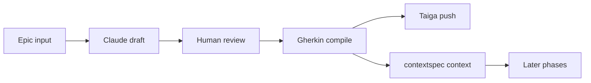

# Apex

Apex is a Streamlit web app that guides a software team through the SDLC using Claude AI and Taiga. It turns an Epic into formal Gherkin acceptance criteria, pushes stories to Taiga, and keeps the approved requirements in local markdown context that feeds every subsequent phase.


## How it works



1. Open Phase 1 and enter or select a Taiga Epic (or use **Suggest Epics** to generate candidates from your Project Concept).
2. Claude generates a Natural Language story draft.
3. Review and edit the draft in the UI.
4. The app compiles the draft into strict Gherkin acceptance criteria.
5. Edit story titles and Gherkin per story, then confirm the push.
6. Stories are created in Taiga and the approved Gherkin is written to `contextspec/`.

## What's implemented

### Phase 1 · Requirements (full)

**Requirements tab**
- Load or create a Taiga Epic; browse and select from existing epics
- Generate Natural Language user stories via Claude (with AI guidance field)
- Gate on Taiga sign-in, active project, and Project Concept — each missing prerequisite shows a targeted warning
- Edit the NL draft interactively before locking it in
- Compile the draft into formal Gherkin acceptance criteria
- Edit story titles, sizes, and Gherkin per story before pushing
- Push stories to Taiga with tags and board status
- Save the approved Gherkin to `contextspec/functional-spec.md`
- Draft survives page refresh via `.apex-draft.json`

**Suggest Epics tab**
- Generate a list of 5–10 scoped Epics from the Project Concept in the Memory Bank
- Optional focus/constraints hint field
- Regenerate for a fresh set without clearing the current list
- "Use this Epic →" loads the selected Epic into the Requirements tab automatically

### Sidebar

- **Context** — live editor for Memory Bank, Functional Spec, Technical Spec, Vaccine Records (spec files shown conditionally by active phase)
- **Epics & Stories board** — load, expand, and manage epics and their stories; story/epic detail popups with Gherkin keyword highlighting and inline title/tag/status editing
- **Users & Roles** — project member list (name · email · role side by side), inline role change, invite by username/email
- **Account** — current user shown as name · email; ⇄ button opens a Switch Account dialog (username/password or auth-token paste); shows "Sign in to Taiga →" when not connected
- **Project switcher** — change or create Taiga projects without leaving the app
- **Theme toggle** — light/dark mode persisted across sessions

### Phases 2–6

Present in the UI as navigation stubs: Design, Implementation, Testing, Deployment, Maintenance.

## Architecture

| File / folder | Role |
|---|---|
| `app.py` | Entry point — page config, theme injection, routing |
| `components/sidebar.py` | Sidebar: nav, context editor, AI/Taiga status, board, user management |
| `components/phase1.py` | Full Phase 1 workflow component (Requirements + Suggest Epics tabs) |
| `src/ai_engine.py` | LangChain + Claude prompts and structured outputs |
| `src/context_manager.py` | Reads/writes `contextspec/` markdown files |
| `src/taiga_adapter.py` | Taiga REST API client (GET/POST/PATCH/DELETE) |
| `views/phase1.py … phase6.py` | Thin Streamlit page wrappers |
| `contextspec/` | Persistent project context (Gherkin, memory bank, etc.) |
| `tests/` | Pytest test suite (all APIs mocked) |

## Tech stack

Python 3.12 · Streamlit · LangChain · Anthropic Claude · Pydantic · Requests · python-dotenv

---

## Running the app

### Prerequisites

| Requirement | Notes |
|---|---|
| Python 3.12+ | Local dev only |
| Docker 24+ | Container run |
| Anthropic API key | Required — set in `.env` |
| Taiga account | Optional upfront — sign in via the sidebar ⇄ button on first launch |

### 1 · Environment setup

Only the Anthropic key is needed upfront. Taiga credentials are entered via the sidebar on first use and saved automatically.

```bash
cp .env.example .env
```

Edit `.env`:

```env
ANTHROPIC_API_KEY=sk-ant-...

# Taiga — filled automatically by the app when you sign in via the sidebar:
# TAIGA_API_URL=https://api.taiga.io
# TAIGA_PROJECT_ID=
# TAIGA_AUTH_TOKEN=

# Optional model overrides
# AI_MODEL_FAST=claude-haiku-4-5-20251001
# AI_MODEL_CODER=claude-sonnet-4-6
```

> **Never commit `.env`.** It is listed in `.gitignore`.

### 2 · Local Python

```bash
pip install -r requirements.txt
streamlit run app.py
```

Open [http://localhost:8501](http://localhost:8501). On first visit with no Taiga token, click the **⇄** button in the sidebar to sign in with username/password or paste an auth token (find it at Taiga → Profile → Edit profile → API token). The token is saved to `.env` automatically.

### 3 · Docker

```bash
docker build -t apex:local .

docker run -e ANTHROPIC_API_KEY=sk-ant-... \
  -p 8501:8501 \
  -v "$(pwd)/contextspec:/app/contextspec" \
  apex:local
```

No Taiga credentials needed in advance — sign in through the sidebar. The `-v` flag mounts `contextspec/` so context files survive container restarts.

### 4 · Docker Compose (recommended)

```bash
docker compose up --build
```

Compose reads `.env` automatically and mounts `contextspec/` as a volume. Open [http://localhost:8501](http://localhost:8501).

```bash
docker compose down   # stop
```

### 5 · Pre-built image from CI

After each push to `main`, GitHub Actions publishes a fresh image:

```bash
docker run -e ANTHROPIC_API_KEY=sk-ant-... \
  -p 8501:8501 \
  -v "$(pwd)/contextspec:/app/contextspec" \
  ghcr.io/thomastabs/apex:latest
```

Pin to a specific commit to avoid surprise updates:

```bash
ghcr.io/thomastabs/apex:sha-<commit>
```

---

## Tests

All external APIs are mocked — no real credentials needed:

```bash
pip install -r requirements.txt pytest
python3 -m pytest tests/ -v
```

## CI/CD

`.github/workflows/ci.yml` runs on every push and pull request to `main`:

| Job | When | What |
|---|---|---|
| `test` | every push / PR | Runs all pytest tests with stub env vars |
| `build` | after `test` passes | Builds the Docker image; pushes to `ghcr.io` on `main` only |

Registry auth uses the built-in `GITHUB_TOKEN` — no manual secrets needed.
