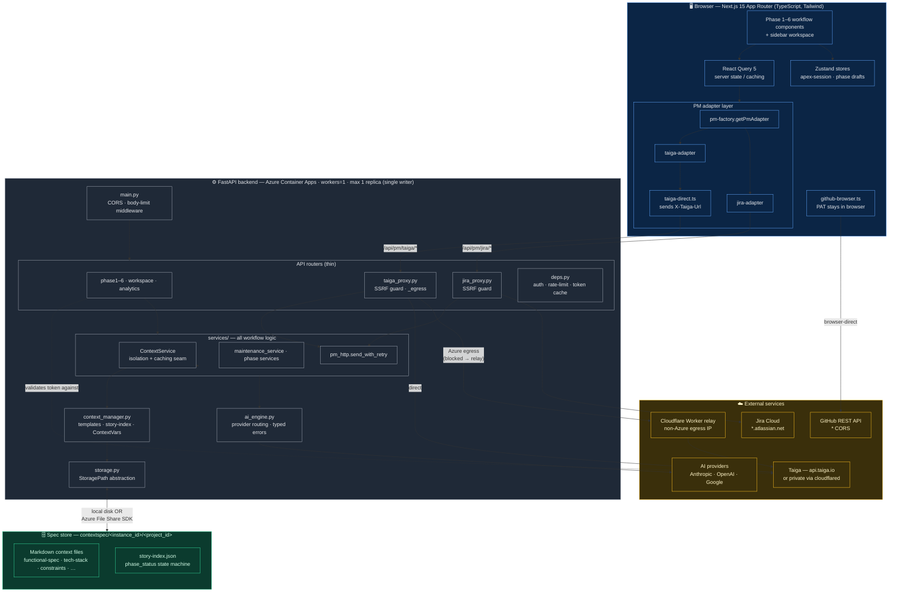
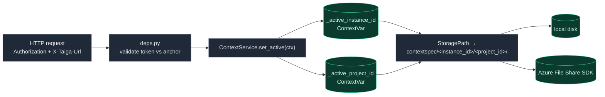
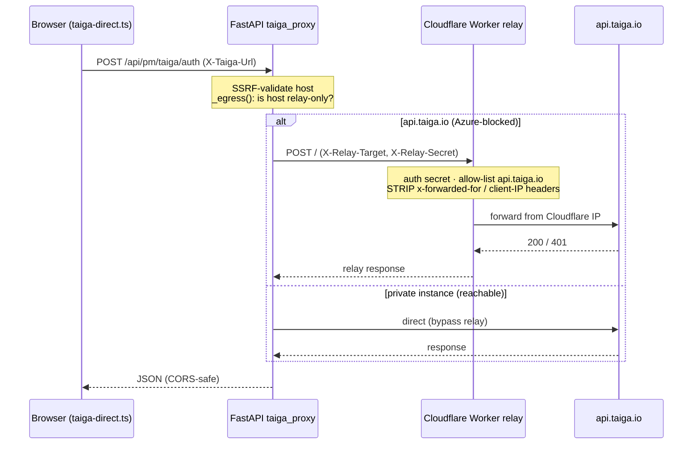
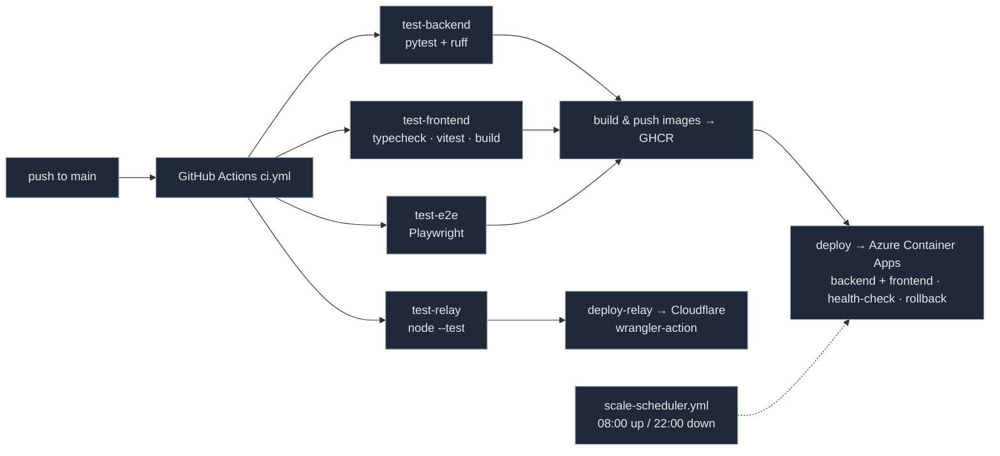

# Apex — System Architecture

A reference architecture diagram for the Apex Spec-Anchored Human–AI Collaboration
Framework, suitable for inclusion in the thesis. The companion document
[`user-flow.md`](user-flow.md) covers the workflow from the user's perspective.

> **Rendering for the thesis.** GitHub renders the Mermaid blocks below inline.
> To export a vector/raster copy:
> ```bash
> npx -y @mermaid-js/mermaid-cli -i docs/architecture.md -o architecture.svg
> npx -y @mermaid-js/mermaid-cli -i docs/architecture.md -o architecture.pdf
> ```
> or paste a block into <https://mermaid.live> and export SVG/PNG.

---

## 1. High-level architecture

Split stack: a Next.js browser app, a single-writer FastAPI backend that owns all
workflow logic and reverse-proxies every project-management call, a versioned
spec store (`contextspec/`), and pluggable external services (PM tools, AI
providers, GitHub).



### Layer responsibilities

| Layer | Stack | Responsibility |
|---|---|---|
| **Client** | Next.js 15 (App Router), React 19, React Query 5, Zustand, Tailwind | Renders the Phase 1–6 workflow; React Query owns server state, Zustand owns UI/session/draft state. All PM traffic goes through the adapter layer; only GitHub is called browser-direct. |
| **PM adapter** | `pm-factory` → `taiga-adapter` / `jira-adapter` against the `ProjectManagementAdapter` interface | Single seam for PM operations; new PM operations are added to both adapters + the interface. |
| **Backend** | Python 3.12, FastAPI, Pydantic v2 | Owns all workflow logic; routers are thin and delegate to `services/`. Reverse-proxies every Taiga/Jira call (SSRF-guarded). Single writer (`workers=1`, max 1 replica). |
| **Isolation seam** | `ContextService` + two `ContextVar`s | Per-request project + instance isolation; all context-file / story-index access funnels here for caching + tenancy. |
| **Spec store** | Markdown + `story-index.json` on local disk or Azure File Share | The versioned single source of truth; `phase_status` drives phase gating. |
| **AI** | `ai_engine.py` | Provider chosen by model-ID prefix (`claude-*` / `gpt-*` `o1/o3-*` / `gemini-*`); AI errors map to typed HTTP statuses. |

---

## 2. Multi-tenant request isolation

State is partitioned by **instance** (the validated PM host) **× project**, so Taiga
Cloud and private/self-hosted instances are isolated tenants on the same shared
File Share.



`instance_id = instance_key(host)` of the validated PM anchor (e.g. `api_taiga_io`).
The single-writer/single-replica invariant is what makes the per-process caches
(token validation, rate-limit buckets, story-index mtime, workspace-config TTL)
coherent — the backend must **not** be scaled past one replica.

---

## 3. Taiga egress path (Azure deployment)

Taiga Cloud firewall-DROPs Azure Container Apps egress IPs, so the backend routes
`api.taiga.io` traffic through a Cloudflare Worker that presents a non-Azure
source IP. The Worker **must strip `x-forwarded-for`** or the Azure IP leaks back
to Taiga's origin and triggers HTTP 520.



---

## 4. Deployment & CI/CD



- **Backend** pinned to **max 1 replica** (single writer); only the stateless
  frontend scales to zero overnight.
- Storage is the **Azure File Share** (SDK, no FS mount) in production; local disk
  in dev/CI.
- The **relay Worker** deploys independently of the Azure pipeline, only when
  `infra/cloudflare/taiga-relay/` changes.
