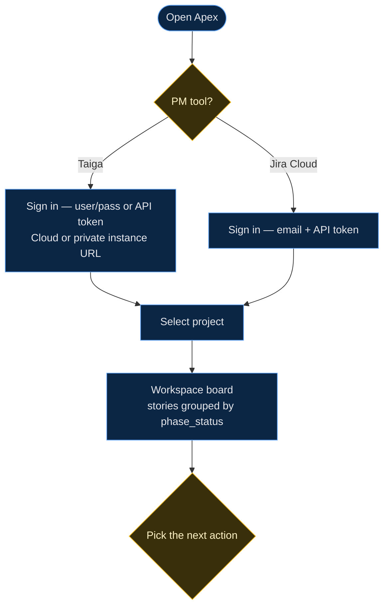
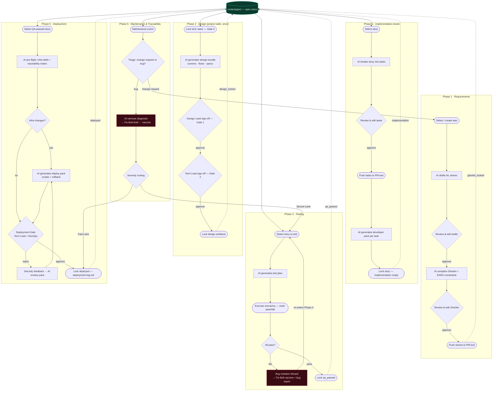

# Apex — User Flow

The Apex workflow from the **user's** perspective: who acts, where a human review
or sign-off gates progress, and how work moves between phases. For the system
architecture see [`architecture.md`](architecture.md).

> **Rendering for the thesis.** GitHub renders Mermaid inline. To export:
> ```bash
> npx -y @mermaid-js/mermaid-cli -i docs/user-flow.md -o user-flow.svg
> ```
> or paste a block into <https://mermaid.live>.

Legend: **rounded** = user action · **rectangle** = AI-assisted step ·
**diamond** = human decision / gate · **green cylinder** = the spec store that
every phase reads from and writes to · **red** = Fix-Bolt remediation.

---

## 1. Entry: sign in and select a project



From the board the user enters whichever phase a story is ready for. `phase_status`
(`new → gherkin_locked → design_locked → implementation → qa → qa_passed →
deployed`) is the state machine that decides what is available.

---

## 2. Full phase flow



---

## 3. Who does what

| Phase | User role(s) | Human gate before lock |
|---|---|---|
| 1 · Requirements | PM / BA | Review NL drafts **and** compiled Gherkin |
| 2 · Design | Design Lead + Tech Lead | Gate 0 (tech stack) → Gate 1 (Design Lead) → Gate 2 (Tech Lead) |
| 3 · Implementation | Developer / Tech Lead | Review & edit the task breakdown |
| 4 · Testing | QA | Testing Gate — every scenario marked pass before `qa_passed` |
| 5 · Deployment | Tech Lead + DevOps | Deployment Gate (two-party sign-off; reject loops back) |
| 6 · Maintenance | Maintainer / Tech Lead | Triage decision + severity routing |

Every AI output is a **suggestion**: nothing advances `phase_status` until a human
reviews, edits if needed, and explicitly locks it. The spec store is the contract
between phases — each phase consumes the locked artefacts of the previous one.
